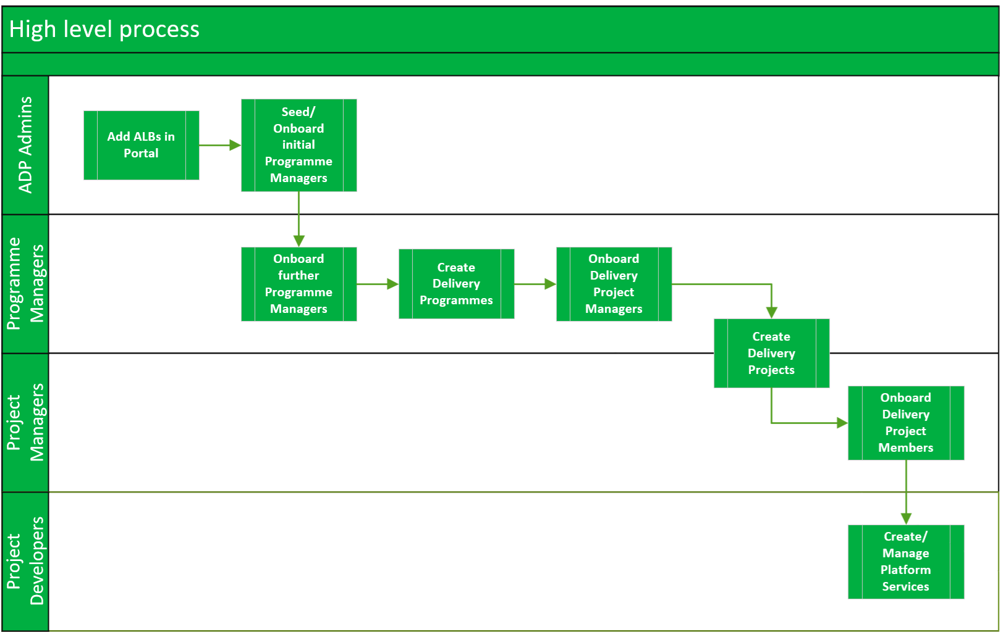
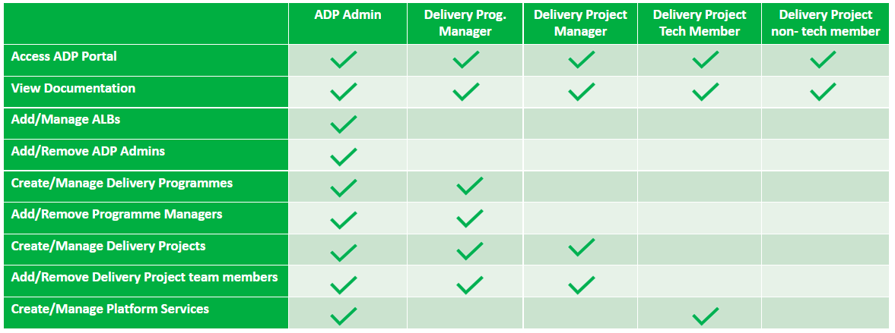

# ADP Data Plugin
## Overview
ADP enables authorised users to self-service through the platform, allowing them to create and manage required arms-length bodies, delivery programmes, and delivery teams. The data added can subsequently be edited by those authorised users and viewed by all.

The diagram below illustrates the high-level process flow of user journeys, distinguishing between four types of users: ADP Admins, Programme Managers, Project Managers, and Project Developers. ADP Admins have the authority to create new ALBs (Arms-Length Bodies) and initially seed Programme Managers. Programme Managers are able to onboard additional Programme and Project Managers, as well as to create Delivery Programmes and Projects. Project Managers have the capability to create new Delivery Projects and onboard Delivery Project Members. Finally, Project Developers are tasked with creating and managing platform services.

### Portal Permissions

In the table below you can see the permissions per ADP Persona. Please note that users are not restricted to one role/persona. A single person may be a Programme Manager, a Team Manager for a team in their Programme and a developer within that team.

## Backend APIs

### ALB 
#### Endpoint: /armsLengthBody

| Method | Parameters | Example Request Body                                   | Example Response                                                                                                                                                                                                                                                                                                                                                                                                                                                                                              |
| ------ | ---------- | ------------------------------------------------------ | ------------------------------------------------------------------------------------------------------------------------------------------------------------------------------------------------------------------------------------------------------------------------------------------------------------------------------------------------------------------------------------------------------------------------------------------------------------------------------------------------------------- |
| GET    |            | N/A                                                    | `[{ "creator":"user:default/johnDoe", "owner":"owner value", "title":"ALB 1", "alias":"ALB", "description": "ALB description", "url": null, "name":"alb-1", "id": "123", "created_at": "2024-02-26T15:58:40.337Z", "updated_at": "2024-02-26T15:58:40.337Z","updated_by": "user:default/johnDoe"}`, `{ "creator":"user:default/johnDoe", "owner":"owner value", "title":"ALB 2", "alias":"ALB", "description": "ALB description", "url": null, "name":"alb-2", "id": "1234", "created_at": "2024-02-26T15:58:40.337Z", "updated_at": "2024-02-26T15:58:40.337Z","updated_by": "user:default/johnDoe"}]` |
| GET    | `id`       | N/A                                                    | `{ "creator":"user:default/johnDoe", "owner":"owner value", "title":"ALB 1", "alias":"ALB", "description": "ALB description", "url": null, "name":"alb-1", "id": "123", "created_at": "2024-02-26T15:58:40.337Z", "updated_at": "2024-02-26T15:58:40.337Z","updated_by": "user:default/johnDoe"}`                                                                                                                                                                                                                                                          |
| POST   |            | `{ "title": "ALB", "description": "ALB Description" }` | `{ "title": "ALB", "description": "ALB Description" , "url": null, "alias": null, "name": "alb", "creator":"user:default/johnDoe", "owner":"owner value", "id": "12345","created_at": "2024-02-26T15:58:40.337Z", "updated_at": "2024-02-26T15:58:40.337Z","updated_by": "user:default/johnDoe"}`                                                                                                                                                                                                                                                          |
| PATCH  | `id`       | `{ "id": "12345", "title": "Updated ALB Title" }`      | `{ "title": "Updated ALB Title", "description": "ALB Description" , "url": null, "alias": null, "name": "alb", "creator":"user:default/johnDoe", "owner":"owner value", "id": "12345","created_at": "2024-02-26T15:58:40.337Z", "updated_at": "2024-02-26T15:58:40.337Z","updated_by": "user:default/johnDoe"}`                                                                                                                                                                                                                                            |

#### Endpoint: /armsLengthBodyNames

| Method | Example Response                                                      |
| ------ | --------------------------------------------------------------------- |
| GET    | `{"123": "ALB 1","1234": "ALB 2","12345": "ALB 3","123456": "ALB 4"}` |

### Delivery Programmes
#### Endpoint: /deliveryProgramme

| Method | Parameters | Example Request Body                                                                                                                                                                                                                                                                                                    | Example Response                                                                                                                                                                                                                                                                                                                                                                                                                                                                                                                                                                                                                                                                                                                                                                                  |
| ------ | ---------- | ----------------------------------------------------------------------------------------------------------------------------------------------------------------------------------------------------------------------------------------------------------------------------------------------------------------------- | ------------------------------------------------------------------------------------------------------------------------------------------------------------------------------------------------------------------------------------------------------------------------------------------------------------------------------------------------------------------------------------------------------------------------------------------------------------------------------------------------------------------------------------------------------------------------------------------------------------------------------------------------------------------------------------------------------------------------------------------------------------------------------------------------- |
| GET    |            | N/A                                                                                                                                                                                                                                                                                                                     | `[{ "id": "123", "programme_managers":[], "arms_length_body_id": "12345", "title": "Delivery Programme 1", "name": "delivery-programme-1", "alias": "Delivery Programme", "description": "Delivery Programme description", "finance_code": "1", "delivery_programme_code": "123", "url": "exampleurl.com" , "created_at": "2024-02-26T15:58:40.337Z", "updated_at": "2024-02-26T15:58:40.337Z","updated_by": "user:default/johnDoe"}, { "id": "1234", "programme_managers":[], "arms_length_body_id": "12345", "title": "Delivery Programme 2", "name": "delivery-programme-2", "alias": "Delivery Programme", "description": "Delivery Programme description", "finance_code": "1", "delivery_programme_code": "123", "url": "exampleurl.com" , "created_at": "2024-02-26T15:58:40.337Z", "updated_at": "2024-02-26T15:58:40.337Z","updated_by": "user:default/johnDoe"}]` |
| GET    | `id`       | N/A                                                                                                                                                                                                                                                                                                                     | `{ "id": "123", "programme_managers":[{"aad_entity_ref_id": "123", "id": "1", "delivery_programme_id" :"123", "email": "email@example.com", "name": "John Doe"}], "arms_length_body_id": "12345", "title": "Delivery Programme 1", "name": "delivery-programme-1", "alias": "Delivery Programme", "description": "Delivery Programme description", "finance_code": "1", "delivery_programme_code": "123", "url": "exampleurl.com" , "created_at": "2024-02-26T15:58:40.337Z", "updated_at": "2024-02-26T15:58:40.337Z","updated_by": "user:default/johnDoe"}`                                                                                                                                                                                                                                                                          |
| POST   |            | `{ "programme_managers":[{"aad_entity_ref_id": "123"}, {"aad_entity_ref_id": "1234"}], "arms_length_body_id": "12345", "title": "Delivery Programme", "alias": "Delivery Programme", "description": "Delivery Programme description", "finance_code": "1", "delivery_programme_code": "123", "url": "exampleurl.com" }` | `{ "id": "1234", "programme_managers":[], "arms_length_body_id": "12345", "title": "Delivery Programme", "name": "delivery-programme", "alias": "Delivery Programme", "description": "Delivery Programme description", "finance_code": "1", "delivery_programme_code": "123", "url": "exampleurl.com" , "created_at": "2024-02-26T15:58:40.337Z", "updated_at": "2024-02-26T15:58:40.337Z","updated_by": "user:default/johnDoe"}`                                                                                                                                                                                                                                                                                                                                                                                                      |
| PATCH  |            | `{ "id": "1234", "title": "Updated Delivery Programme Title" }`                                                                                                                                                                                                                                                         | `{ "id": "1234", "programme_managers":[], "arms_length_body_id": "12345", "title": "Updated Delivery Programme Title, "name": "delivery-programme", "alias": "Delivery Programme", "description": "Delivery Programme description", "finance_code": "1", "delivery_programme_code": "123", "url": "exampleurl.com" , "created_at": "2024-02-26T15:58:40.337Z", "updated_at": "2024-02-26T15:58:40.337Z","updated_by": "user:default/johnDoe"}`                                                                                                                                                                                                                                                                                                                                                                                         |

#### Endpoint: /programmeManager

| Method | Example Response                                                                                                                                                                                                                                                                                                                                                                                                                            |
| ------ | ------------------------------------------------------------------------------------------------------------------------------------------------------------------------------------------------------------------------------------------------------------------------------------------------------------------------------------------------------------------------------------------------------------------------------------------- |
| GET    | `[{"id": "5464de88-bc76-4a0b-a491-77284c392dab","delivery_programme_id": "0bd0cb6b-569a-4c0f-bc6d-5b8708f45c4a","aad_entity_ref_id": "aad entity ref id 1" "email": "example@defra.onmicrosoft.com","name": "name 1"},{"id": "f0bca259-d0a2-4d30-8166-4569f8e7b6f2","delivery_programme_id": "0bd0cb6b-569a-4c0f-bc6d-5b8708f45c4a","aad_entity_ref_id": "aad entity ref id 2","email": "example@defra.onmicrosoft.com","name": "name 2"}]` |

#### Endpoint: /catalogEntities

| Method | Example Response                                                                                                                                                                                                                                                                                                                                                                                                                                                               |
| ------ | ------------------------------------------------------------------------------------------------------------------------------------------------------------------------------------------------------------------------------------------------------------------------------------------------------------------------------------------------------------------------------------------------------------------------------------------------------------------------------ |
| GET    | ` {"items": [ {"metadata": { "name": "example.onmicrosoft.com", "annotations": {"graph.microsoft.com/user-id": "aad entity ref id 1","microsoft.com/email": "example@defra.onmicrosoft.com"}},"spec": {"profile": {"displayName": "name 1"}}},{"metadata": {"name": "example.onmicrosoft.com","annotations": {"graph.microsoft.com/user-id": "aad entity ref id 2","microsoft.com/email": "example@defra.onmicrosoft.com"}},"spec": {"profile": {"displayName": "name 2"}}}]}` |
|        |

### Delivery Projects 

#### Enpoint: /deliveryProject

| Method | Parameters | Example Request Body                                                                                                                                                                                                     | Example Response                                                                                                                                                                                                                                                                                                                                                                                                                                                                                                                                                                                                                                                                                                                                                                       |
| ------ | ---------- | ------------------------------------------------------------------------------------------------------------------------------------------------------------------------------------------------------------------------ | -------------------------------------------------------------------------------------------------------------------------------------------------------------------------------------------------------------------------------------------------------------------------------------------------------------------------------------------------------------------------------------------------------------------------------------------------------------------------------------------------------------------------------------------------------------------------------------------------------------------------------------------------------------------------------------------------------------------------------------------------------------------------------------- |
| GET    |            | N/A                                                                                                                                                                                                                      | `[{"id": "123","name": "delivery-project-1","title": "Delivery Project 1","alias": "Delivery Project","description": "Delivery Project Description","finance_code": "","delivery_programme_id": "1","delivery_project_code": "1","url": "","ado_project": "","created_at": "2024-04-03T06:41:56.257Z","updated_at": "2024-04-03T08:42:48.242Z","updated_by": "user:default/johnDoe.com"}, {"id": "1234","name": "delivery-project-2","title": "Delivery Project 2","alias": "Delivery Project","description": "Delivery Project Description", "finance_code": "", "delivery_programme_id": "2", "delivery_project_code": "2", "url": "", "ado_project": "", "created_at": "2024-04-03T05:42:31.914Z", "updated_at": "2024-04-03T08:43:03.622Z","updated_by": "user:default/johnDoe"}]` |
| GET    | `id`       | N/A                                                                                                                                                                                                                      | `{"id": "1234","name": "delivery-project-2","title": "Delivery Project 2","alias": "Delivery Project","description": "Delivery Project Description", "finance_code": "", "delivery_programme_id": "2", "delivery_project_code": "2", "url": "", "ado_project": "", "created_at": "2024-04-03T05:42:31.914Z", "updated_at": "2024-04-03T08:43:03.622Z","updated_by": "user:default/johnDoe"}`                                                                                                                                                                                                                                                                                                                                                                                           |
| POST   |            | `"title": "Delivery Project 3","alias": "Delivery Project","description": "Delivery Project Description", "finance_code": "", "delivery_programme_id": "3", "delivery_project_code": "3", "url": "", "ado_project": ""}` | `{"id": "12345","name": "delivery-project-3","title": "Delivery Project 3","alias": "Delivery Project","description": "Delivery Project Description", "finance_code": "", "delivery_programme_id": "3", "delivery_project_code": "3", "url": "", "ado_project": "", "created_at": "2024-04-03T05:42:31.914Z", "updated_at": "2024-04-03T08:43:03.622Z","updated_by": "user:default/johnDoe"}`                                                                                                                                                                                                                                                                                                                                                                                          |
| PATCH  |            | `{ "id": "12345", "title": "Updated Delivery Project Title" }`                                                                                                                                                           | `{"id": "12345","name": "delivery-project-3","title": "Updated Delivery Project Title","alias": "Delivery Project","description": "Delivery Project Description", "finance_code": "", "delivery_programme_id": "3", "delivery_project_code": "3", "url": "", "ado_project": "", "created_at": "2024-04-03T05:42:31.914Z", "updated_at": "2024-04-03T08:43:03.622Z","updated_by": "user:default/johnDoe"}`                                                                                                                                                                                                                                                                                                                                                                              |
