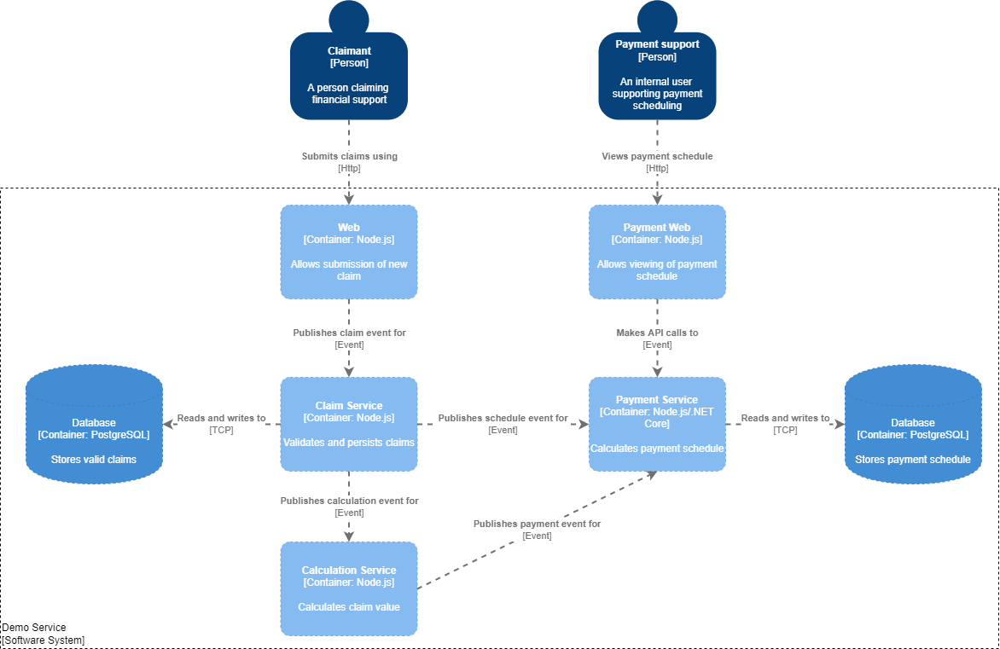
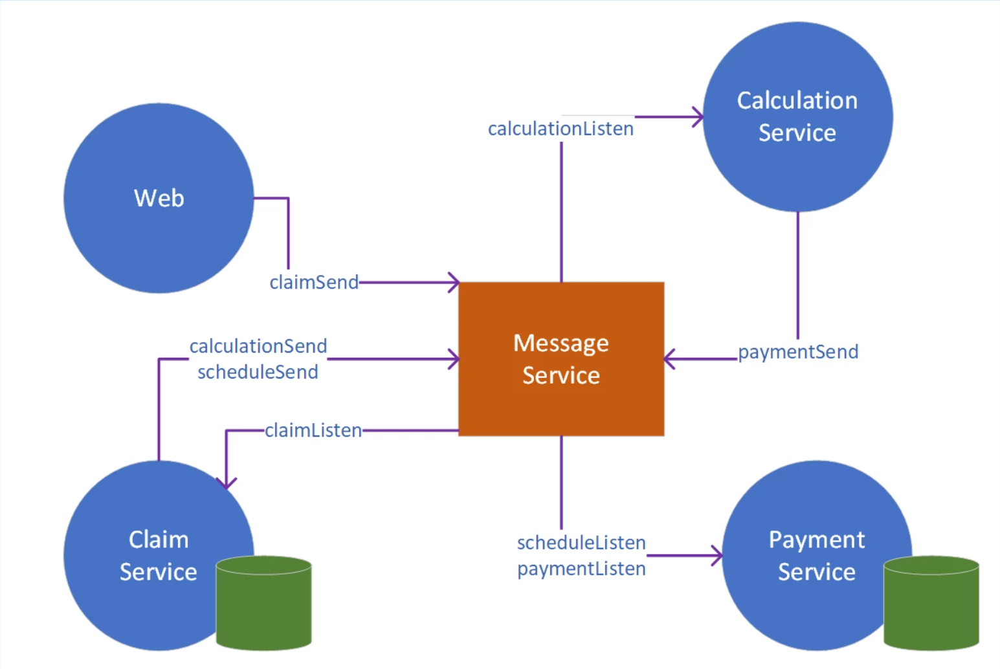

# FCP Demo Services

This documentation is to capture the existing design of demo/exemplar services in FFC platform. This will provide an overview of the components in the demo services and application flow.

The demo service contains 6 containerized microservices orchestrated with Kubernetes. The purpose of these services are to prove the platform capability to provision the infrastructure required for developing a digital service along with CI/CD pipelines with minimal effort. This in turn allows the developers to focus on the core business logic.

## Language of choice

- Node.Js
- ASP.NET Core

## Tools & External Dependencies

- Azure Service Bus for messaging
- PgSql

## Existing Demo Services

Below are the demo services that are present at the moment.

| Service               | Dev Platform | Git Repo                                               |
| --------------------- | ------------ | ------------------------------------------------------ |
| Payments Service      | Node.Js      | https://github.com/DEFRA/ffc-demo-payment-service      |
| Payments Service Core | Asp.Net Core | https://github.com/DEFRA/ffc-demo-payment-service-core |
| Payments Web          | Node.Js      | https://github.com/DEFRA/ffc-demo-payment-web          |
| Claim Service         | Node.Js      | https://github.com/DEFRA/ffc-demo-claim-service        |
| Calculation Service   | Node.Js      | https://github.com/DEFRA/ffc-demo-calculation-service  |
| Collector Service     | Node.Js      | https://github.com/DEFRA/ffc-demo-collector            |
| Demo Web              | Node.Js      | https://github.com/DEFRA/ffc-demo-web                  |

## Business Context

## Microservice Architecture

### Other Services

- Demo Apply Service
  _Generated from Claims service. Needs further clarification from dev team._
- Demo Apply Web
  _Generated from Demo web app. Needs further clarification from dev team._

## Testing

|                                                        | Code | Docker Compose | Dev | Test | Pre-production |
| ------------------------------------------------------ | ---- | -------------- | --- | ---- | -------------- |
| Lint/Audit                                             | X    |                |     |      |                |
| Synk Test                                              | X    |                |     |      |                |
| Static Code Analysis/ SonarCloud                       | X    |                |     |      |                |
| Functionional/ BDD                                     |      | X              | X   |      |                |
| Intergration Tests/ Contract testing using pact broker |      |                | X   | X    |                |
| Performance Testing (JMeter)                           |      |                |     |      | X              |
| Pen Testing (OWASP ZAP)                                |      | X              |     |      | X              |

* **Code**
  * Lint/Audit
  * Synk Test
  * Static Code Analysis/Sonar Cloud
* **Docker Compose**
  * Functional/BDD
  * Pen Testing
* **Dev**
  * Functional/BDD
  * Integrations Test/Contract testing using Pact Broker
* **Test**
  * Integrations Test/Contract testing using Pact Broker
* **Pre-production**
  * Performance testing (Jmeter)
  * Pen Testing

### Challenges

- Docker compose is good if the application is full contained, but it has dependencies, which are unknown at present.
- Could remove Docker compose tests,  run in SND2 or SND3 , then install dependencies and helm chart which update flux

### Considerations for discussion

- DAPR -  with RabbitMQ for containerized testing
- Open Policy Agent (OPR)

### DAPR

- Distributed Application Runtime simplifies the authoring of distributed, microservice- based applications.
- Once DAPR is enabled for a container app, a secondary process is created alongside the application that enables communication with DAPR via HTTP or gRPC

### Open Policy Agent

Azure Policy extends Gatekeeper v3, an admission controller webhook for Open Policy Agent (OPA), to apply at-scale enforcements and safeguards on your clusters in a centralized, consistent manner. Azure Policy makes it possible to manage and report on the compliance state of your Kubernetes clusters from one place. The add-on enacts the following functions:

- Checks with Azure Policy service for policy assignments to the cluster.
- Deploys policy definitions into the cluster as constraint template and constraint custom resources.
- Reports auditing and compliance details back to Azure Policy service.

Azure Policy for Kubernetes supports the following cluster environments:

- Azure Kubernetes Service (AKS)
- Azure Arc enabled Kubernetes

### Further reading

https://learn.microsoft.com/en-us/azure/governance/policy/concepts/policy-for-kubernetes
https://learn.microsoft.com/en-us/azure/container-apps/dapr-overview?tabs=bicep1%2Cyaml

## Service Details

!!! note "TODO"
    This page is a work in progress and will be updated in due course.

    Add to details about each service.