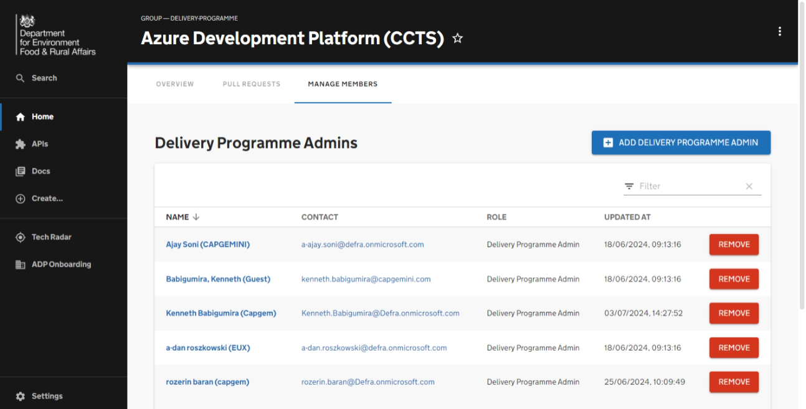

# Onboarding a delivery programme

This getting started guide summarises the steps for onboarding a delivery programme onto ADP via the Portal. It also provides an overview of the automated processes involved.

## Prerequisites

Before onboarding a delivery programme you will first need to ensure that:

- The Arms Length Body (ALB) for your programme has been created within the ADP Portal.
- You have an active user account within the ADP Portal.
- You are already a Delivery Programme Admin for another delivery programme.
- You have a unique "Delivery Programme code" or "Service Code" for your Delivery Programme.

If you are not already a Delivery Programme Admin, you will need one of the members of the ADP Platform Team to create the programme for you.

## Overview

By completing the steps in this guide you will be able to:

- [X] Add a new delivery programme to the ADP portal database under the programme's ALB.
- [X] Assign delivery programme admins to administer & maintain the delivery programme.

# Guide

## Creating a Delivery Programme

Once you have navigated to the 'ADP Data' page you will be presented with the 'Delivery Programmes' option. 

By clicking 'View' you will have the ability to view existing Delivery Programmes and add new ones if you have the admin permissions. 

## Entering Delivery Programme information

You can start entering Delivery Programme information by clicking the 'Add Delivery Programme' button.

You will be presented with various fields; some are optional. For example, the 'Finance Code', 'Website', and 'Alias' are not required, and you can add them later if you wish.

If the Arms Length Body (ALB) for your programme has already been created it will appear in the Arms Length Body dropdown and you will be able to select it accordingly.

This form includes validation. Once you have completed inputting the Delivery Programme Information and pressed 'create', the validation will run to check if any changes need to be made to your inputs.

## Updating Delivery Programme information

Once you have created your Delivery Programme, the delivery programme will appear in the Delivery Programme list, as well as in the catalog as a new Group. You can click the link in the Name column to view the Delivery Programme in the catalog.

Clicking the edit button will bring up a form to allow you to change the information about your Delivery Programme

## Managing Delivery Programme Admins

You are able to manage Delivery Programme Admins through the Manage Members tab in the Delivery Programmes catalog page, which can be accessed by clicking the user config button. On this page you are able to add or remove users from the Delivery Programme.

There is only one role for members of a Delivery Project which is admin. Anyone added to the Delivery Programme will be able to manage any projects under the programme, as well as edit the programme itself.

