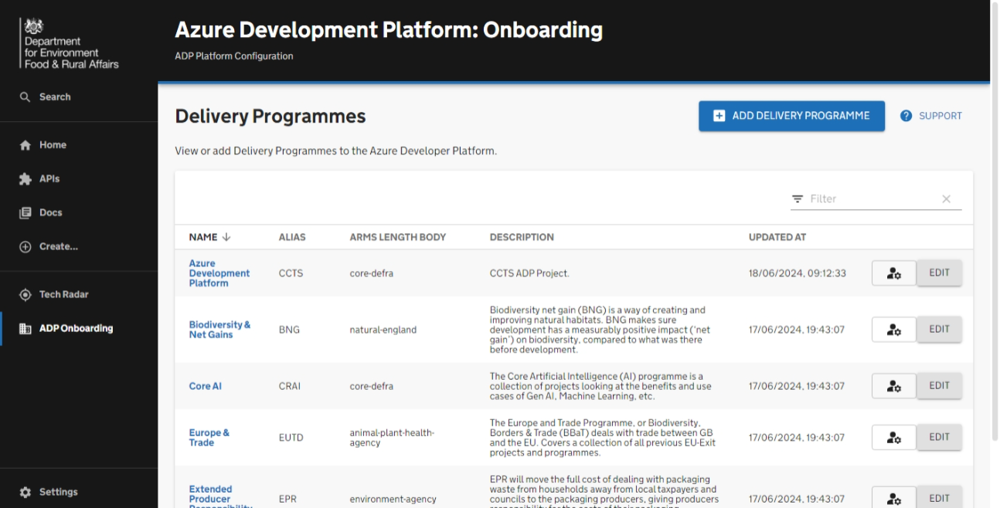
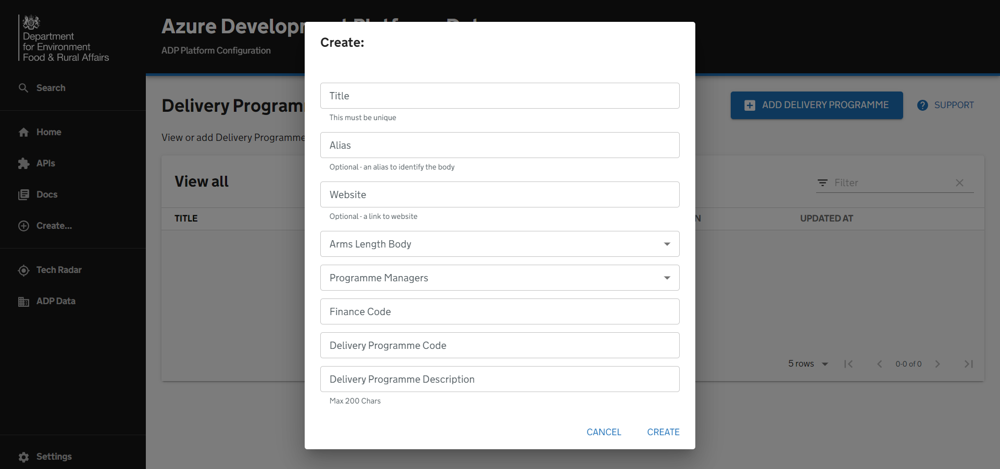
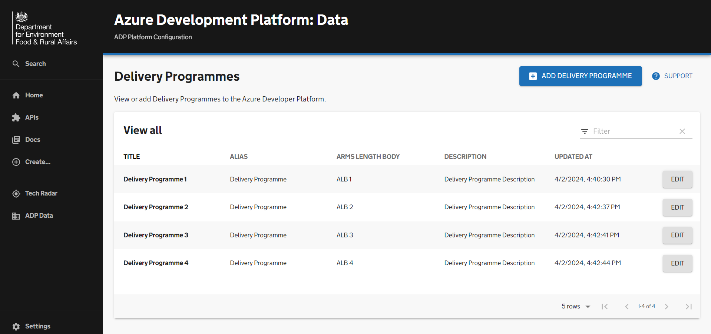

# Onboarding a delivery programme

This getting started guide summarises the steps for onboarding a delivery programme onto ADP via the Portal. It also provides an overview of the automated processes involved.

## Prerequisites

Before onboarding a delivery programme you will first need to ensure that:

- The Arms Length Body (ALB) for your programme has been created within the ADP Portal.
- You have an active user account within the ADP Portal with admin permissions to create a delivery programme within your selected ALB.
- You have a unique "Delivery Programme code" or "Service Code" for your Delivery Programme

## Overview

By completing the steps in this guide you will be able to:

- [ ] Add a new delivery programme to the ADP portal database under the programme's ALB.
- [ ] Add a new delivery programmes catalog files to [adp-software-templates](https://github.com/DEFRA/adp-software-templates).
- [ ] Assign delivery programme managers to administer & maintain the delivery programme.

# Guide

## Creating a Delivery Programme

Once you have navigated to the 'ADP Data' page you will be presented with the 'Delivery Programmes' option. 

By clicking 'View' you will have the ability to view existing Delivery Programmes and add new ones if you have the admin permissions. 

## Entering Delivery Programme information

You can start entering Delivery Programme information by clicking the 'Add Delivery Programme' button.

You will be presented with various fields; some are optional. For example, the 'Finance Code', 'Website', and 'Alias' are not required, and you can add them later if you wish.

The Arms Length Body (ALB) that was created for your programme should appear in the Arms Length Body dropdown, and you should be able to select it accordingly. The programme managers' dropdown should also be pre-populated, and you are able to select more than one manager.

This form includes validation. Once you have completed inputting the Delivery Programme Information and pressed 'create', the validation will run to check if any changes need to be made to your inputs.

## Updating Delivery Programme information

Once you have created your Delivery Programme, you will automatically be redirected to the view page which will allow you to look through existing programmes and edit them. 

