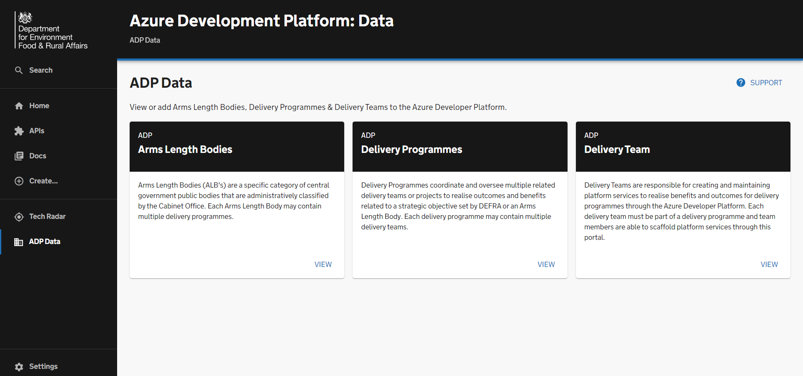
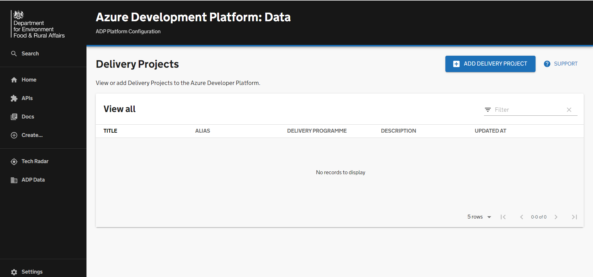
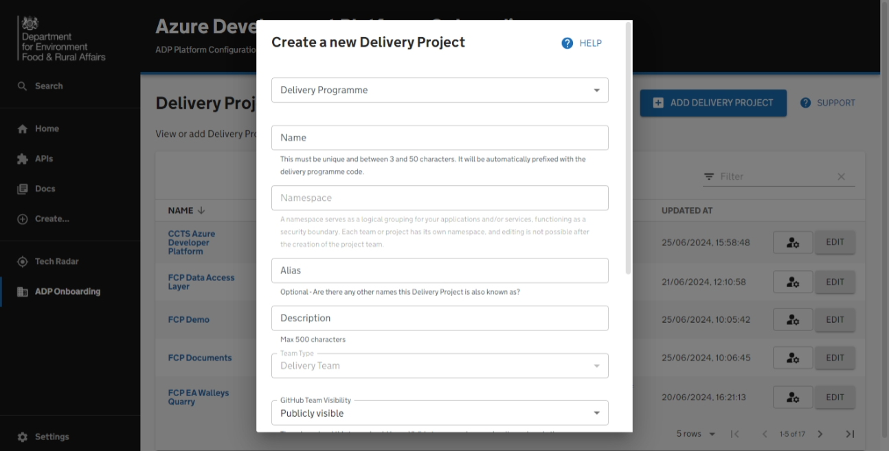
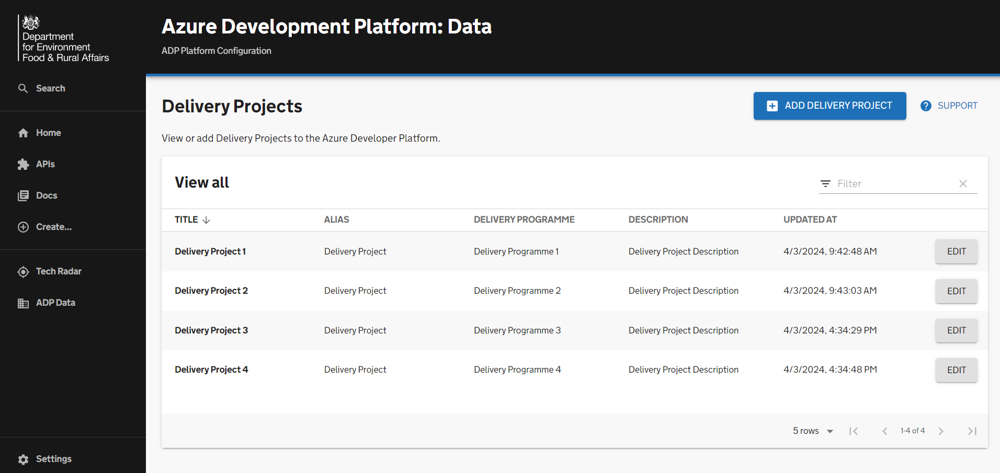

# Onboarding a delivery project

This getting started guide summarises the steps for onboarding a delivery project onto ADP via the Portal. It also provides an overview of the automated processes involved.

## Prerequisites

Before onboarding a delivery project you will first need to ensure that:

- The delivery programme for your project has been onboarded onto ADP, see the Getting Started guide for [Onboarding a delivery programme on to ADP](onboarding-a-delivery-programme.md).
- You have an active user account within the ADP Portal with admin permissions to create a delivery project within your selected delivery programme.
- You have a "Service Code" and "Cost Centre" for your delivery project.

## Overview

By completing this guide you will have completed these actions:

- [ ] Adding a new delivery project to ADP portal database under your programme.
- [ ] Adding a new delivery project catalog files to [adp-software-templates](https://github.com/DEFRA/adp-software-templates).
- [ ] Assign delivery project admins to adminster delivery project.
- [ ] Adding creation of a new ADO Team on a selected ADO project.
- [ ] Adding creation of GitHub Team for delivery project.
- [ ] Adding Azure group(s) for the delivery project's tech users. Members of this group will be given access to common platform resources and project resource group in tenants, and Defra
  - [ ] O365_DefraDev  - SND3, data and control plane read/ write.
  - [ ] Defra - DEV1, TST1/2, data and control plane read/ write.
  - [ ] Defra - PRE1, PRD1, ready access on the control plane. No data plane access given

# Guide

## Creating a Delivery Project

Once you have navigated to the 'ADP Data' page you will be presented with the 'Delivery Projects' option. 

By clicking 'View' you will have the ability to view existing Delivery Projects and add new ones if you have the admin permissions. 

## Entering Delivery Project information

You can start entering Delivery Projects information by clicking the 'Add Delivery Projects' button.

You will be presented with various fields; some are optional. For example, the 'Alias', 'Website', 'Finance Code' and 'ADO Project' are not required, and you can add them later if you wish.

If the Delivery Programme for your project has already been created it will appear in the Delivery Programme dropdown, and you will be able to select it accordingly. 

This form includes validation. Once you have completed inputting the Delivery Project Information and pressed 'create', the validation will run to check if any changes need to be made to your inputs.

### Assign delivery project admins to adminster delivery project.
...
### Adding creation of a new ADO Team on a selected ADO project.
...
### Adding creation of GitHub Team for delivery project.
...
### Adding Azure group(s) for the delivery project's tech users.
...

## Updating Delivery Project information
Once you have created your Delivery Project, you will automatically be redirected to the view page which will allow you to look through existing projects and edit them. 

