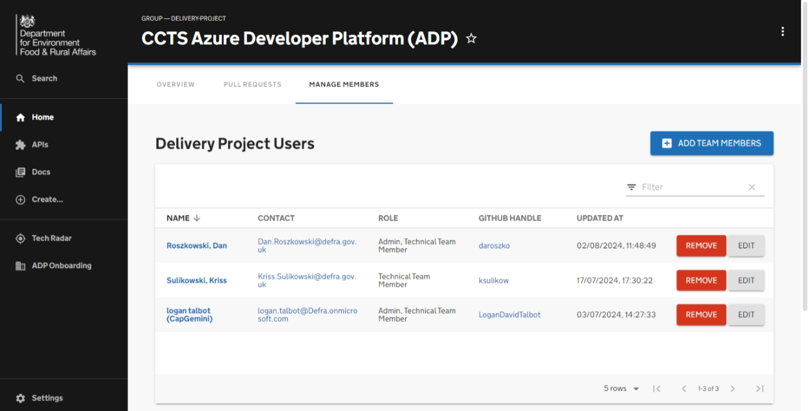
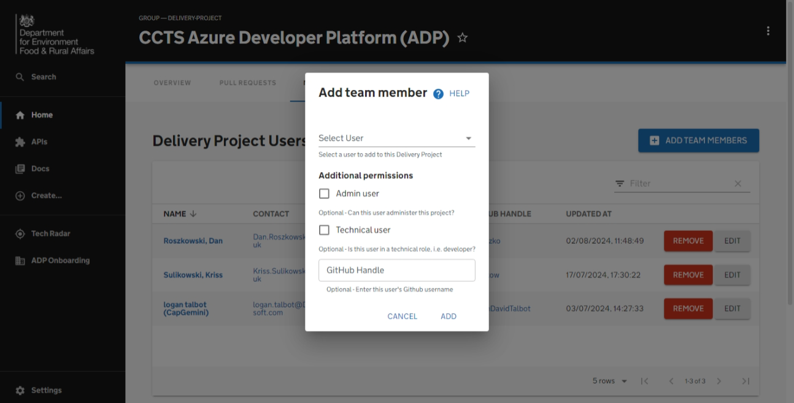

# Onboarding a user

This getting started guide summarises the steps for onboarding a user onto your delivery project in ADP. It also provides an overview of the automated processes involved.

## Prerequisites

Before onboarding a user on to your delivery project you will first need to ensure that:

- The delivery project has been onboarded via the ADP portal, see the Getting Started guide for [Onboarding a delivery project on to ADP](onboarding-a-delivery-project.md).
- You have an active user account within the ADP Portal with admin permissions to onboard users to your selected delivery project.
- The user you are onboarding has a valid cloud account (with the domain as: @defra.onmicrosoft.com or @defra.gov.uk). [Need to link to guidence on how to get a cloud account].
- If the user you are onboarding is a tech user, they must have a valid GitHub handle.
- GitHub account added to DEFRA's SonarCloud organisation.

## Overview

By completing this guide you will have completed these actions:

- [X] Understanding of tech and non-tech users.
- [X] Adding user to ADP portal database under your delivery team. [Not automated]
- [X] Adding user to Azure AD ADP portal group, allowing basic read acess to the ADP portal. [Not automated]
- [X] Adding user to ADO Team, allowing access to delivery project's ADO project. [Not automated]
- [X] Adding user to Defra's VPN group.
- [X] Adding tech user to GitHub Team.
- [X] Adding tech user to Azure group, allowing access to delivery project's Azure resources.

# Guide

You can add a user to a Delivery Project from the Manage Members tab on the Delivery Projects page. You can get to this page by searching for your delivery project in the catalog with the [kind set to Group and the type to delivery-project](https://portal.adp.defra.gov.uk/catalog?filters%5Bkind%5D=group&filters%5Btype%5D=delivery-project&filters%5Buser%5D=all). Alternatively, you can find the delivery project via the 'Delivery Projects' card in the ADP Onboarding page. 

## Onboarding a Delivery Project Member

When adding a user to a delivery project, you will need to select which user to add as well as what roles to grant them.

There are 2 roles which can be assigned to a user for a Delivery Project:
- Technical User - A user who is able to scaffold new services and contribute to existing ones
- Admin - A user who can manage the Delivery Project, including editing it and managing its members

If a user is going to be a Technical user, you will need to provide a github handle so they can be added to the correct teams in github.

If neither 'additional permission' roles are selected, the user will be added to the delivery project as a "Team Member"

