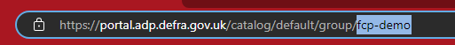

# What is a system?

A system is a label used to group together multiple related services. This label is recognized and used by backstage in order to make it clear what services interact with eachother. They are a concept which is provided by backstage out of the box, and is documented by them [here](https://backstage.io/docs/features/software-catalog/system-model#system)

# How to create a system

In order to create a system, you simply need to add a new definition for it to the [ADP software templates repository](https://github.com/DEFRA/adp-software-templates/tree/main/systems). There is [an example system](https://github.com/DEFRA/adp-software-templates/tree/main/systems/example.yaml) to show the format that should be used. Once this system is added, you need to add a link to it from the [all.yaml file](https://github.com/DEFRA/adp-software-templates/tree/main/systems/all.yaml). You will also need to choose a name for your system, which should be in the format `{delivery-project-id}-{system-name}-system` e.g. `fcp-demo-example-system`

Once the system has been added and the `all.yaml` file has been updated, you will need to wait for the ADP portal to re-scan the repository which happens every hour. If you need the system to be available sooner than that, then an ADP admin can trigger a refresh at any time by requesting a refresh of the [project-systems location](https://portal.adp.defra.gov.uk/catalog/default/location/project-systems).

## The `all.yaml` file

The `all.yaml` file is what tells the ADP portal where to find the systems, and so every file containing a definition for a system must be pointed to by this file. To point to a new file, you will need to add a new entry to the `targets` array which should be the relative path from the `all.yaml` file to your new system file.

`all.yaml`
```yaml
apiVersion: backstage.io/v1alpha1
kind: Location
metadata:
  name: project-systems
  description: Systems defined and owned by projects using ADP.
spec:
  targets:
    # There is no need to modify any of the file above this point.
    - ./another-projects-system.yaml
    - ./my-system.yaml # Reference a system by a relative path like this.
```

## The `{system}.yaml` file

Your system will actually be defined inside its own `.yaml` file. The name of this file should be the name of the system you are creating to make it easier to track which system is defined where. The format of this file should follow this example:

`my-system.yaml`
```yaml
apiVersion: backstage.io/v1alpha1
kind: System
metadata:
  # This is the id of the system you want to create. It should be less than 100 characters long and
  # only contain letters, numbers and hyphens and be in the format `{delivery-project-id}-{system-name}-system`
  name: fcp-demo-example-system
  # The description is meant to give users a bit of information about what sort of services are meant
  # to be linked to this system and what it represents. This can be any text that you like, as long as it is valid yaml.
  description: An example system, intended to be used to help projects to create their own systems.
spec:
  # This needs to be a reference to the project that owns the system you are creating. This will always
  # start with `group:default/`, and the ending bit should be the id of your project. You can find the id
  # of your project in the url when you view it in the ADP portal, it will be the last segment of the URL
  owner: "group:default/fcp-demo"
```

