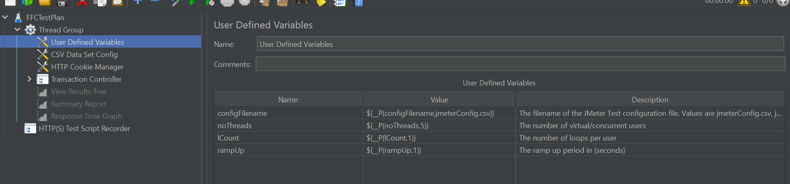
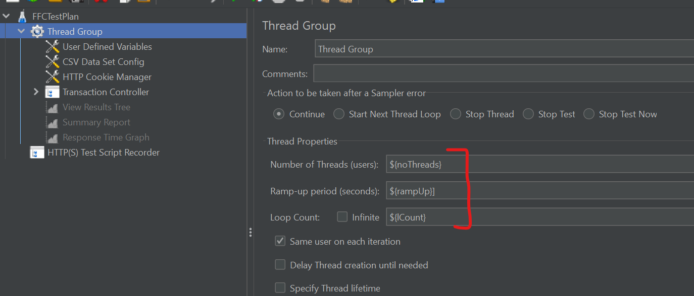

## How to acceptance test

In this how to guide you will learn how to create, deploy, and run a performance test for a Platform service (Web App, User Interface etc) for your team.

## Prerequisites

Before adding acceptance tests for your service, you will need to ensure that:

- [Onboarded delivery project on to ADP](../../Getting-Started/onboarding-a-delivery-project.md)
- [Created a Platform Service for your team/delivery project](../../How-to-guides/how-to-create-a-platform-service.md)

## Overview

By completing this guide, you will have completed these actions:

- [x] Learned how to add a performance test for your service.
- [X] Learned how to run a performance test locally.
- [X] How to customize your pipeline to run performance tests for different env.

## Guide

> Every pipeline run includes steps to run varoious tests pre deployment and post deployment.

These tests may include unit, integration, acceptance, performance, accessibilty etc as long as they are defined for the service.

> The pipeline will check for the existence of the file `test\performance\docker-compose.jmeter.yaml` to determine if performance tests have been defined.

### How to add a performance test for your service?

The Performance Test scripts should be added to the `test\performance` folder in the GitHub repository of the service. Refer to the [ffc-demo-web example](https://github.com/DEFRA/ffc-demo-web/tree/main/test/performance). This folder should contain a `docker-compose.jmeter.yaml` file is used to build up the docker containers required to execute the tests. As a minimum, this will create a JMeter container and optionally create Selenium Grid containers. Using BrowserStack is preferred to running the tests using Selenium Grid hosted in Docker containers because you get better performance and scalability as the test load increases.

#### Requirments for local development

- Docker Desktop 2.2.0.3 (42716) or higher
- JMeter v5.5 or above

### How to run a performance test locally?

Executre the above commands in bash or PowerShell

```ps1

cd test/performance

# this will execute the docker-compose at the root folder to create an instance of the service and its dependences
# and then it will create the performance testing containers (JMeter and any other containers specified in docker-compose.jmeter.yaml)
docker-compose -f ../../docker-compose.yaml -f docker-compose.jmeter.yaml run jmeter-test

```

### How to parameterising your Tests

You can modify the number of virtual users, loop count and ramp-up duration by changing the settings in the file perf-test.properties.

```yaml


# Sample user.properties file
#---------------------------------------------------------------------------
# Properties added to manage noThreads rampUp lCount values
#---------------------------------------------------------------------------
noThreads=15 
rampUp=1 
lCount=2

```

You can then reference these variables in your JMeter Script.





### How to customize your pipeline to run performance tests?

You can customize the environments where you would like to run specific features or scenarios of performance test

```yaml
postDeployTest:      
  testEnvs:
    performanceTests: pre1
  envToTest: snd4,dev1,tst1,pre1
```

if not defined, the pipeline will run with following default settings

```yaml
postDeployTest:      
  testEnvs:
    performanceTests: snd4, pre1
  envToTest: snd4,dev1,tst1,pre1
```

[Please refer ffc-demo-web pipeline:](https://github.com/DEFRA/ffc-demo-web/blob/main/.azuredevops/build.yaml)
