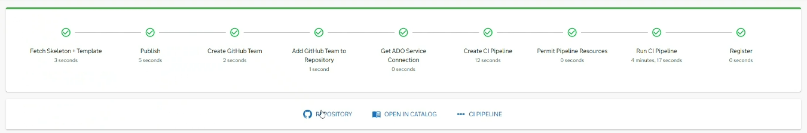
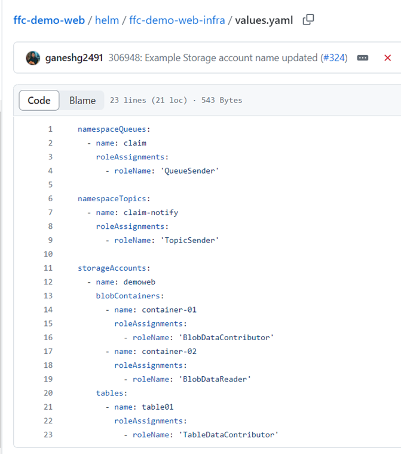

# How to create a platform service

In this how to guide you will learn how to create a new Platform service on ADP for your delivery project and team. You will also learn what automated actions will take place, and any areas of support that may be needed.

## Prerequisites

Before creating Platform business service (microservice), you will first need to ensure that you have:

- [Onboarded delivery project on to ADP](../Getting-Started/onboarding-a-delivery-project.md).
- An active user account on the ADP Portal with admin or user access to/for the delivery project team.
- You will need an Azure DevOps project for Pipeline management for your project/programme.
- In your teams Azure DevOps (ADO) project, you will need to ensure that the __ADP Platform Service Account__ has the correct permissions for scaffolding your service Pipelines:
  - These permissions are Project, Build, and Endpoint Administrator. Read & Manage Environments.
  - The ADP Platform Engineers or CCoE can manage this for you.

!!! note
    Please contact the ADP Platform Engineering team for support if you don’t have, and cannot setup/configure, these prerequisites. 

### Overview

By completing this guide, you will have completed these actions:

- [x] Created a GitHub team for the services' delivery project (if not already present) in Defra GitHub org.
  - [x] Developers are added to your GitHub team.
- [x] Scaffolded an ‘exemplar’ Platform service (microservice application) in your chosen development language, with any optional infrastructure.
- [x] Scaffolding of an ADO project if not already done:
  - [x] Share service connection and agent pools with ADO project.
  - [x] Create ADO environment and ‘secrets’ variable group in ADO project.
  - [x] Authorizes the Service Connection between the created ADO Pipeline & GitHub repository.
- [x] Creation of an ADO CI/CD Pipeline for the Service in the selected ADO project.
- [x] Starts the running of your Service CI/CD Pipeline: Builds and deploys your service into the Sandpit / Development environment.
  - [x] Initialization of Sonar Cloud project, Snyk scanning, Service Manifests, etc.
- [x] Register your Service in the [Backstage Catalog](https://backstage.io/docs/features/software-catalog/) (via Catalog info YAML file).

#### Areas of support

The following areas require the support of the ADP Platform Team for your service initial setup:

- [ ]	Domain (URL) creation 

!!! note
    The initial domain (Frontend service or external API URL) creation is currently done via the Platform team pipelines. Please contact the Platform team to create this per environment once the service is scaffolded.

## Guide

### Selecting a template

1.	On the ADP portal click ‘Create...’ on the left-hand side menu.
2.	Select the ‘CHOOSE’ button of the template of the service you would like to create.

!!! tip
    You can choose a Node.js for Frontends, or for Backends and APIs in Node.Js or C#.

### Entering Component Information

Enter properties describing your component/ service:

Enter the properties describing your component/service:

1.	Enter __Component Name__ (service name). It must be a unique name of the component which will be used for the repository, package, and image name. 
  1.	This should be in the format `{programme}-{project}-{service}`. For example, fcp-grants-web.
2.	Enter __Description__. Describes what this component does. This description will be used in the component's README and package.json.
3.	Select the __System__ that this component/service will be a part of. __Systems__ are a collection of related components and resources (i.e., your entire service and associations).
4.	Select the Project Phase which suits your service. Refer to the [GDS service manual](https://www.gov.uk/service-manual/agile-delivery) for more information.
5.	Select the __Owner__ (team) who will own this component (i.e., your delivery team).
6.	Optionally: Select the initial __infrastructure__ (Queues/Topics, Database etc) you want to deploy with your service.
  1.	More infra can be added/updated later via the YAML file in your repo!
7.	Click the __Next__ button to continue.

### Entering Git Repository information

To encourage coding in the open the repository will be public by default. Refer to the [GDS service manual](https://www.gov.uk/service-manual/technology/making-source-code-open-and-reusable) for more information. You can select a ‘private’ repository by selecting the ‘private repo’ flag in GitHub.

The scaffolder will create a new repository and an associated team with ‘Write’ permissions:

1.	The __host__ where the repository will be created – the default will be the GitHub organisation of DEFRA.
2.	Enter __name of the repositor__. Should be the same as component name (service name).
3.	Enter __GitHub Team Name__. This team will be granted ‘Write’ access to the repository.
4.	Enter __GitHub Team Description__. An optional description of the team.
5.	Enter __GitHub Team Members__. Using comma-separated list of GitHub usernames to be added to the team. For example: GitHubName1,GitHubName2.
6.	Select __GitHub Team Visibility__. This is privacy level this team should have. By selecting Visible teams can be seen by all members in the organization. Secret teams can only be seen by the organization owners and team members.
7.	Click __Next__ to move to the next page.

### Entering CI/CD information

CI/CD pipelines will be created in Azure DevOps:

1.	__Azure DevOps Organization__. *This will be defaulted to: `DefraGovUK` and not changeable.
2.	Enter your projects ‘__Azure DevOps Project Name__’. This is the name of your project you are a member of and wish to scaffold your pipelines into.
3.	__Service Connection Name__. *This will be defaulted and not changeable.
4.	Enter the __Pipeline Folder__. The Folder Path is the directory structure for the Pipeline which will be created in your project. For example: ADP/fcp-grants-web.
1.	  Hint: You can group many pipelines into one Folder structure.
5.	Click __Review__ to move to the next page.

### Reviewing entered information

1. Review the information entered and click __back__ if you would like to amend any of the provided information.
2. If you think all entered information is correct click the __create__ button to being creation of your new service.

### Creating the service

Now you have reviewed and confirmed your details, your new Platform service will be created! It will complete the actions detailed in the overview section. Once this process completes, you will be given links to your new GitHub repository, the Portal Catalog location, and your Pipelines. You now have an ADP business service!

### Creation of additional infrastructure

We use HELM Charts to deploy, manage and update Platform service applications and their dedicated and associated infrastructure. This is ‘self-service’ managed by the platform development teams/tenants. We use Azure Bicep/PowerShell for all other Azure infrastructure and Entra ID configuration, including Platform shared and ‘core’ infrastructure. This is managed by the ADP Platform Engineers team. An Azure Managed Identity ([Workload ID](https://learn.microsoft.com/en-us/azure/aks/workload-identity-overview?tabs=dotnet)) will be automatically created for every service (microservice app) for your usage (i.e. assigning RBAC roles to it).

#### How do I use the HELM Charts for infrastructure with my application?

The creation of infrastructure dedicated for your business service/application is done via your [microservice HELM Chart](../Developer-Reference/Infrastructure/ASO%20Helm%20Library%20Chart.md) in your repository, and deployed by your Service CI/CD pipeline that you created earlier. A ‘helm’ folder will be created in every scaffolded service with 2 folders. The one ending is ‘-infra’ is where you define your service’s infrastructure in a simple YAML format.

!!! note
    The full list of supported ‘self-service’ infrastructure can be found in the [ADP ASO Helm Library Documentation](../Developer-Reference/Infrastructure/ASO%20Helm%20Library%20Chart.md) on GitHub with instructions on how to use it.

Image below is an example of how-to self-service create additional infrastructure by updating the HELM charts ‘values.yaml’ file with what you require to be deployed:

!!! warning
    Please contact the ADP Platform Engineers Team if you require any support after reading the provided documentation or if you’re stuck.