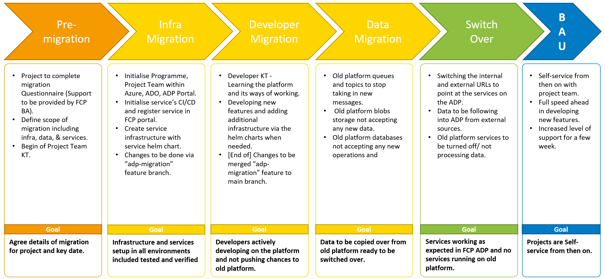
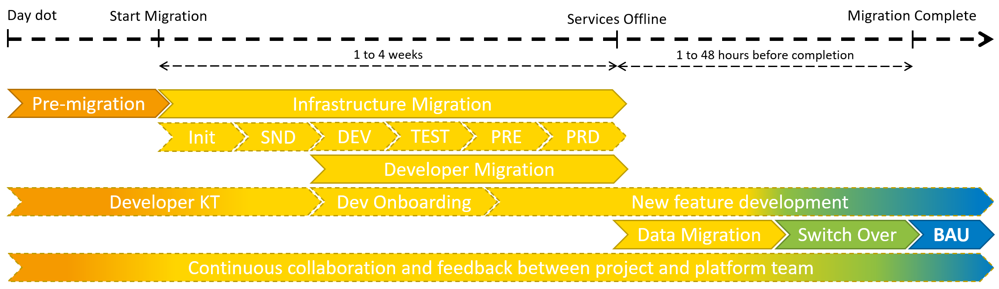

# Project Migration Process

Details on migrating your existing project and its services to ADP.

## Project Migration Stages

## Project Migration Timeline

# Pre-migration

* Please fill in the migration questionnaire. Template is in the internal ADP documentation GitHub repository [Link].
* Once complete you will agree with the ADP Platform Team & CCoE when to be migrated and onboarded on to ADP.

# Infrastructure Migration

ADP Portal Setup:

1. [Onboarding of delivery programme](../Getting-Started/onboarding-a-delivery-programme.md) if not present already.
2. [Onboarding of delivery project](../Getting-Started/onboarding-a-delivery-project.md)
3. [Onboarding of your team members](../Getting-Started/onboarding-a-user.md)

For each of your platform services you now need to migrate them over to ADP and create the needed infrastructure to support them. [Link to guide](migrate-a-platform-service.md).

Once all services/ infrastructure are created and verified in SND3 (O365_DefraDev), will be begin the process of pushing the services/ infrastructure to environment in the DEFRA tenant, DEV1, TST1/2, and PRE1. Once deployment is complete and tested in lower we will be able to progress to PRD1 ensure that the DEFRA release management progress is adhered to.

# Developer Migration

Developers of the delivery project actively learning and using the platform to develop new features.

As a new developer we recommend starting at "[Why ADP](../index.md)" to under the platforms benefits and challenges.

# Data Migration

Near to completion of the migration before the service goes live on ADP. Data from the old production environment will need to be moved into data services wih in ADP that was created as part of the infrastructure migrations stage. In order for this stage to go smoothly the old production traffic will need to be stopped in order to stop the flow of traffic in to the old data services. Allowing the data of old services to be transferred into the selected ADP data services.

Depending on the selected data service it will require different methods to transfer data between production environment which is detailed in "[migrate-production-data](migrate-production-data.md)".

# Switch Over

...

# Business As Usual (BAU)

Migration complete continue to
