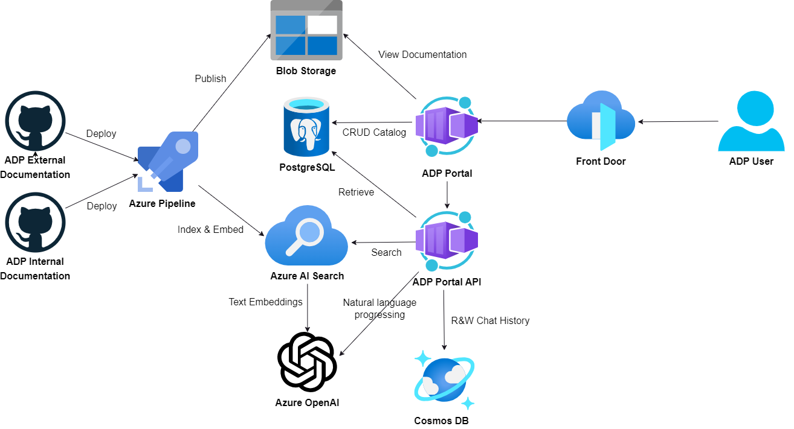

# ADP Copilot

Overview of the ADP Copilot, a tool that provides a conversational interface to the Azure Development Platform (ADP). It outlines the features and capabilities of the ADP Copilot, such as the ability to interact with the ADP Portal, Azure DevOps, and GitHub using natural language. It describes how the ADP Copilot can be used to create, manage, and monitor resources in Azure, Azure DevOps, and GitHub, as well as how it can be used to automate tasks and workflows. The ADP Copilot is designed to streamline the development process and improve collaboration between team members by providing a unified interface for interacting with the ADP Platform.

## Key Features

The ADP Copilot provides the following key features:

- [X] Conversational Interface: Allows users to interact with the ADP Platform using natural language.
- [X] Integration with ADP Documentation: Provides access to the ADP Documentation to view and search for information.
- [X] Integration with ADP Portal: Provides access to the ADP Portal to view and manage resources.


## Architecture



The ADP Copilot is built using the following components:

### ADP Documentation - Azure Pipeline

- Azure Pipeline for building and deploying the ADP Documentation.
  - On commit to `main` branch to ADP External & Internal Documentation.
  - Build and deploy the documentation to Azure Blob Storage.
  - Run a python script to update the ADP Documentation search index storing each document into indexed/ vectorized chunks with the documentation formatter as metadata.

Example of the metadata stored in formatter of the documentation:

```yaml

---
title: ADP Copilot
summary: Overview Architecture of ADP Copilot
uri: https://defra.github.io/adp-documentation/Platform-Architecture/adp-portal/adp-copilot/
authors:
    - Logan Talbot
date: 2024-04-22
---

```

!!! info

    All of these formatter fields are required for the documentation to be indexed correctly.

### ADP Portal API - AI Orchestrator

- ADP Portal API - used to the main AI orchestrator called as API endpoints by the ADP Portal.
  - .NET Core Web API that uses Semantic Kernel to process the natural language queries made by the user and orchestrates the responses from the various services interacted.
  - Semantic Kernel will use OpenAI GPT-4 to process the natural language queries made by the user.


### ADP Portal - Copilot

- ADP Portal will integrate a Chat Copilot into the UI allowing a user to interact with the ADP Platform using natural language.
  - The Chat Copilot will called the ADP Portal API to process the natural language queries made by the user.


### Azure OpenAI - Models

Uk South Azure OpenAI API used to process the natural language queries made by the user. This restricts which models can be used and the amount of data that can be processed.

- OpenAI `GPT-4-turbo`: Used to process the natural language queries made by the user. ADP will also experiment with other models like `GPT 3.5 turbo`.
- OpenAI `text-embedding-ada-002`: Used vectorized and index the ADP Documentation to provide search capabilities. The preferred model would be `text-embedding-3-large` due to its capabilities but it is not available in any UK region.

### Azure AI Search - Search Index

Azure AI Search Index used to store the vectorized and indexed ADP Documentation. There is current only one index used and requires no indexer to populate the index dye to a script that updates the index in the Azure Pipeline:

Index fields:

| Field Name        | Type             | Retrievable | Filterable | Sortable | Facetable | Searchable | Description |
|-------------------|------------------|-------------|------------|----------|-----------|------------|-------------|
| id                | String           | Yes         | Yes        | No       | No        | No         | Unique identifier of the document |
| content           | String           | Yes         | No         | No       | No        | Yes        | Content of the document |
| content_vector    | SingleCollection | Yes         | No         | No       | No        | Yes        | Vector representation of the document content |
| title             | String           | Yes         | No         | No       | No        | Yes        | Title of the document |
| source            | String           | Yes         | Yes        | No       | No        | No         | Source of the document |
| uri               | String           | Yes         | Yes        | No       | No        | No         | URI of the document |
| last_update       | DateTimeOffset   | Yes         | Yes        | No       | No        | No         | Last update timestamp of the document |
| summary           | String           | Yes         | No         | No       | No        | No         | Summary of the document |
| repository        | String           | Yes         | Yes        | No       | No        | No         | GitHub repository of the document |
| metadata          | String           | Yes         | No         | No       | No        | Yes        | full metadata of a document |

### Azure Cosmos DB - Chat History

Azure Cosmos DB used to store the chat history of the user interactions with the ADP Copilot. This is used to provide a history of the interactions for an ADP user and to improve the AI orchestration used and auditing requirements ADP Copilot.

**Example:**

```json

```


## Development Stages

The ADP Copilot is currently in the development stage and is being built in the following stages:

!!! note

    We are using the [Intelligent Application Lifecycle](https://intelligentappfactory.com/intelligent-app-lifecycle/) to develop the ADP Copilot.

**Explore: Proof of Concept**

- [ ] Integrate with the ADP Documentation (external only) with Manual local indexing to popular the Azure AI Search Index.
  - [ ] Add front matter to all markdown files in the ADP Documentation (internal).
  - [X] Create a script to index the ADP Documentation including adding of metadata & chucking of the markdown files by headers.
- [ ] Basic conversational interface integrated with the ADP Portal.
- [ ] Basic Q&A AI Orchestrator using OpenAI GPT-4 & Azure AI Search in the ADP Portal API.
- [ ] Saving of chat history to Azure Cosmos DB.
- [ ] Increasing context of user interactions with the ability to include chat history in the AI Orchestrator.

**Build & Augment**

- [ ] Adding to ADP Documentation Pipeline to update the search index with metadata on commit.
- [ ] Creation of infrastructure for the ADP Copilot. Including:
  - [ ] Azure AI Search
  - [ ] Azure Cosmos DB with Database & Containers
  - [ ] Azure OpenAI API with models deployments (GPT-4-turbo & text-embedding-ada-002)
- [ ] Integrate external ADP Documentation with Azure AI Search Index.
- [ ] TBC


**Improve & Optimise**

TBC