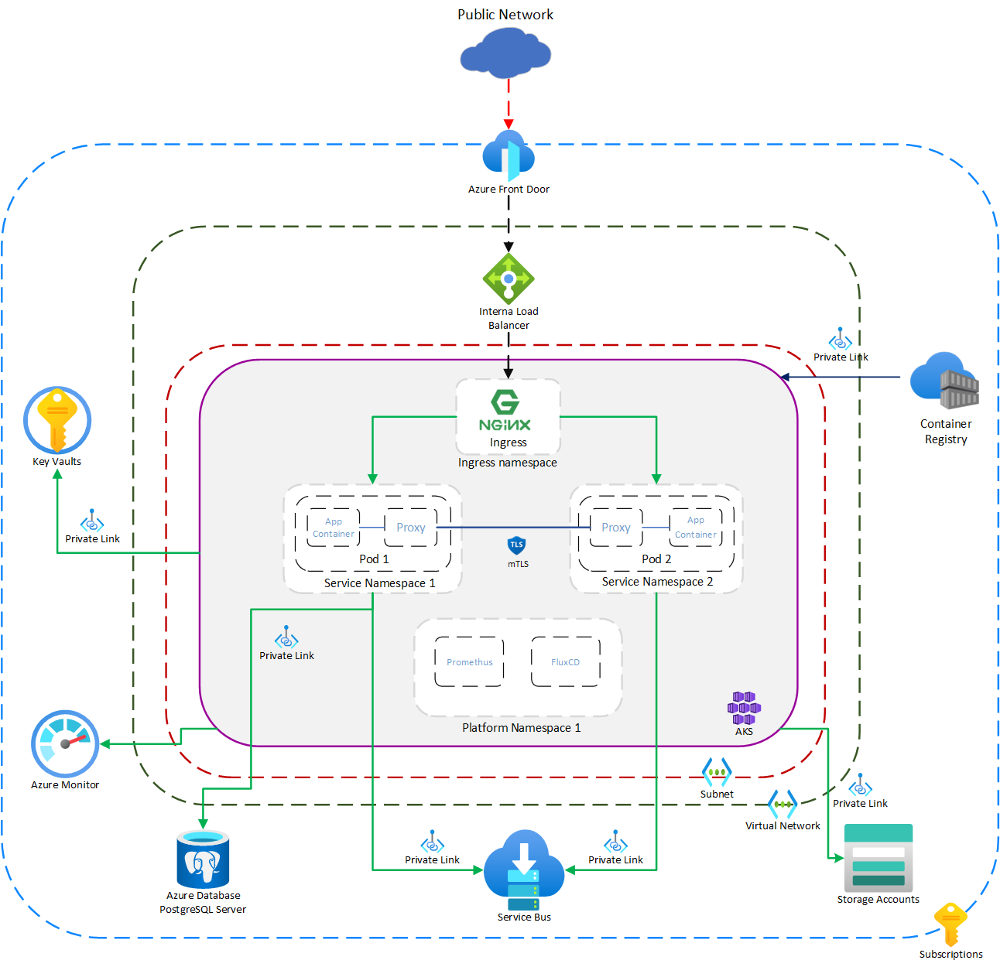

!!! note "TODO"
    This page is a work in progress and will be updated in due course.

# Application Hosting

This article details the Service Application and Hosting Architecture for the solution at a high level. It will detail some of the initial decisions made and reasonings.

This ADR is to record App Hosting services.

**Context -**

Application Hosting is a key part of building and delivering scalable and secure microservices for business services.

**TL;DR-**

ADP will build upon multiple Containerized Hosting options within Azure. Primarily, this will focus on Azure Kubernetes Service (AKS) to orchestrate, scale and run business services in a transparent manner. AKS has been chosen as a primary toolchain because of it's scalability, security and orchestration capabilities. Secondary options that are being continually evaluated and tested include Azure Container Apps (secondary) and Azure Functions (trigger or schedules).

All applications that run be must containerized and the default choice is AKS.

**Requirements-**

- All services must be containerized, and must support any containerized application
- Hosting options should be secure and scalable without degradation
- Must provide good orchestration & management of services
- Must promote CI/CD best practices and should support GitOps
- Should make best use of Cloud provider functionality and integrate well with Cloud Provider concepts and principles
- Meet Azure Well Architected Standards
- Support 100's of services without IP address constraints
- Should be built upon Open-Source technologies

**Decision -**

**Primary**:

- Azure Kubernetes Services (AKS)

**Secondary:**

- Azure Container Apps (ACA)
- Azure Functions

Azure Keyvault supports public CA integration with DigiCert, this is a fully Microsoft managed CSR submission and approval process, this will be used for "Back end" certificates in all environments. https://dev.azure.com/defragovuk/DEFRA-DEVOPS-COMMON/_git/Defra.Certificate.Renewals

**Approval-**

Platform Architecture

- Dan R, Mike B, Ken B.

