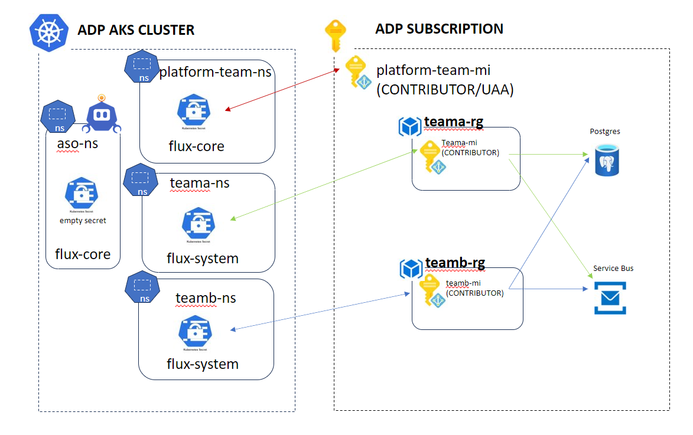

# Azure Service Operator for AKS

## **What is Azure Service Operator?**

[Azure Service Operator (ASO)](https://azure.github.io/azure-service-operator/) allows you to deploy and maintain a wide variety of Azure Resources using the Kubernetes tooling you already know and use, i.e. _HELM, YAML configuration files and FluxCD or Kubectl._

Instead of deploying and managing your Azure resources separately from your Kubernetes application, ASO allows you to manage them together, automatically configuring your application as needed. For example, ASO can set up your Redis Cache or PostgreSQL database server and then configure your Kubernetes application to use them.

### **Why use Azure Service Operator v2?**

- **K8s Native:** we provide CRDs and Golang API structures to deploy and manage Azure resources through AKS.
- **Azure Native:** our CRDs understand Azure resource lifecycle and model it using K8s garbage collection via ownership references.
- **Cloud Scale:** we generate K8s CRDs from Azure Resource Manager schemas to move as fast as Azure.
- **Async Reconciliation:** we don’t block on resource creation, and we can use things like FluxCD to manage infrastructure in a GitOps approach
- **Developer Self-Service:** it allows you, a developer, to manage and deploy your Azure infrastructure alongside your application, and be directly in control of your dependencies.
- **Developer-centric tooling:** our development community on AKS focuses on building applications hosted on AKS, and they can use their native toolsets, such as HELM Charts and YAML Configs to do it - without learning any other language, i.e. Bicep, ARM or Terraform.

**What is the Platform's goal here?**

To enable as much developer self-service as possible for 80% of common developer scenarios when building business services.

**Can I have an example diagram?** - Sure! [have one from Microsoft.. article here...](https://techcommunity.microsoft.com/t5/azure-database-for-mysql-blog/using-azure-service-operator-to-provision-azure-db-for-mysql/ba-p/3056231)


### **What is our alternative approach?**

Currently, we have an approach where developers will use HELM Charts and FluxCD to self service deploy their applications to AKS in a GitOps manner securely. It is a developer-driven CI and CD processes without Platform team involvement for the majority of the work. Common HELM libraries are their to support you as well. With the addition of ASO, this expands to Azure infrastructure too (_storage, queues, identities_) outside of AKS that supports your applications.

If ASO is not appropriate for the scenario or the component isn't supported, we can use our platform-native fallback: Azure Pipelines with Azure Bicep templates and/or PowerShell and CLI scripts. It's important to remember that Bicep and our supporting scripts are our bedrock, defined in such a way that allows for a scalable approach to manage a Service team's dedicated infrastructure. But it requires deeper context of Azure, the configuration and a good understanding of Bicep or PowerShell etc.

With the dual track approach, we can scale and support a wide variety of teams, and have fallback options and Azure native tooling to ensure we can continue to deliver applications to production following assured processes.

**Any other tools exist to compete with ASO?**

1. [CrossPlane](https://www.crossplane.io/)
2. [Score](https://score.dev/blog/score-one-yaml-to-rule-them-all)

### **What is supported for the Platforms ASO?**

| Azure Component                    | ASO Support? | MVP? | Self-Service? | Manage base component? | Description & considerations                                                                 |
| ---------------------------------- | ------------ | ---- | ------------- | ---------------------- | -------------------------------------------------------------------------------------------- |
| Resource Groups                    | Y            | Y    | Y             | Y                      | RG write on Sub only.                                                                        |
| PostgreSQL Database                | Y            | Y    | Y             | N                      | Database write/read on Postgre only. Workload IDs assigned to specific per-service DBs.      |
| Managed Identities                 | Y            | Y    | Y             | Y                      | Can create and assign RBAC                                                                   |
| Storage Accounts                   | Y            | Y    | Y             | Y                      | Can create & manage, with templated support for networking & config                          |
| Service Bus (Queues/Topics)        | Y            | Y    | Y             | N                      | Can only create/read: Queues, Topics, Subscriptions, and RBAC on specific entities.          |
| Authorization (RBAC on components) | Y            | Y    | Y             | N                      | RBAC on designated components within Subscription.                                           |
| Azure Front Door                   | Y            | N    | Y             | N                      | **TBD**: allow self-creation of DNS entries, domains and routes to designated Cluster. |

#### **What about other, unlisted resources?**

 It is safe to assume, if it's not listed, it's not ASO supported and will be directly managed via Bicep templates, modules and PWSH Scripts.

Further to this, you will not be able to fully manage the lifecycle of some resources, i.e. Service Bus or the PostgreSQL Flexible Server. This is by design as it's a Platform responsibility.

#### **How far will you roll ASO out?**

We simply don't know at this stage. It is in trial mode and our approach may differ as we expand, learn more and grow as a Platform.

## Azure Service Operator Setup

We have setup ASO in a Single Operator mode with a multi-tenant configuration, enabling the use of separate credentials for managing resources in different Kubernetes namespace.

##Credential type
Azure Service Operator supports four different styles of [authentication](https://azure.github.io/azure-service-operator/guide/authentication/#credential-type) today.

[Azure-Workload-Identity](https://azure.github.io/azure-service-operator/guide/authentication/credential-format/#azure-workload-identity) authentication (OIDC + Managed Identity) is being used by ASO in ADP.

### Credential scope

Each supported credential type can be specified at one of three supported scopes:

**Global** - The credential applies to all resources managed by ASO.
**Namespace** - The credential applies to all resources managed by ASO in that namespace.
**Resource** - The credential applies to only the specific resource it is referenced on.
_When presented with multiple credential choices, the operator chooses the most specific one: resource scope takes precedence over namespace scope which takes precedence over global scope._

ASO in ADP is using **Namespace** scoped credentials.  Each project team will have an ASO secret in their own namespace linked to a Managed Identity which will only have access to Azure resources the team should be allowed access to.

The Platform Team will have their own ASO credential scoped at the Subscription level with Contributor and UAA access.  This will allow the Platform Team to create Project Team resources using ASO.



The Platform Team will create the following resources using ASO to onboard a Project Team:

- userassigned-identity
- federated-credential
- resource-group
- role-assignments-rg
- role-assignments-sb
- role-assignments-pgdb

### TODO

We still need to work out how to inject certain values automatically into the ASO Kubernetes secrets managed by Flux.  These are currently being added manually as post deployment step.

The values we need to pass in for the [Platform Team secret](https://github.com/DEFRA/adp-flux-core/blob/main/infra/snd/01/platform-team-aso-secret.yaml) are:

- TenantID
- SubscrictionId
- ClientID

The values we need to pass in for the Project [Team secret](https://github.com/DEFRA/adp-flux-services/blob/main/services/base/aso/team-secret.yaml) and [Managed Identity Federated credential](https://github.com/DEFRA/adp-flux-services/blob/main/services/base/aso/federated-credential.yaml) are:

- TEAM_MI_CLIENT_ID
- CLUSTER_OIDC

The below story has been raised to capture the above requirements:
https://dev.azure.com/defragovuk/DEFRA-FFC/_workitems/edit/248355

We have also created a configmap which is manually installed on AKS in SND1.  We did this so we didn't have these variables visible in our public repo.  This will also need to be automated.

```
apiVersion: v1
kind: ConfigMap
metadata:
  name: platform-vars
  namespace: config-cluster-flux
data:
  ENVIRONMENT: "snd"
  ACR_NAME: "sndadpinfcr1401"
  NAMESPACE: "config-cluster-flux"
  SERVICEBUS_RG: "sndadpinfrg1401"
  SERVICEBUS_NS: "sndadpinfsb1401"
  POSTGRES_SERVER_RG: "sndadpdbsrg1401"
  POSTGRES_SERVER: "sndadpdbsps1401"
  INFRA_RG: "sndadpinfrg1401"
  APPCONFIG_SERVICE: "sndadpinfac1401"
  TEAM_MI_PREFIX: "sndadpinfmid1401"
  CLUSTER_OIDC: "https://uksouth.oic.prod-aks.azure.com/6f504113-6b64-43f2-ade9-242e05780007/e1f44edd-ac8e-4e4d-928a-2d2a7a52d4b7/"
  TENANT_ID: "6f504113-6b64-43f2-ade9-242e05780007" 
  SUBSCRIPTION_ID: "55f3b8c6-6800-41c7-a40d-2adb5e4e1bd1"
  SUBSCRIPTION_NAME: "azd-adp-snd1"
  CLUSTER: "01"
```
