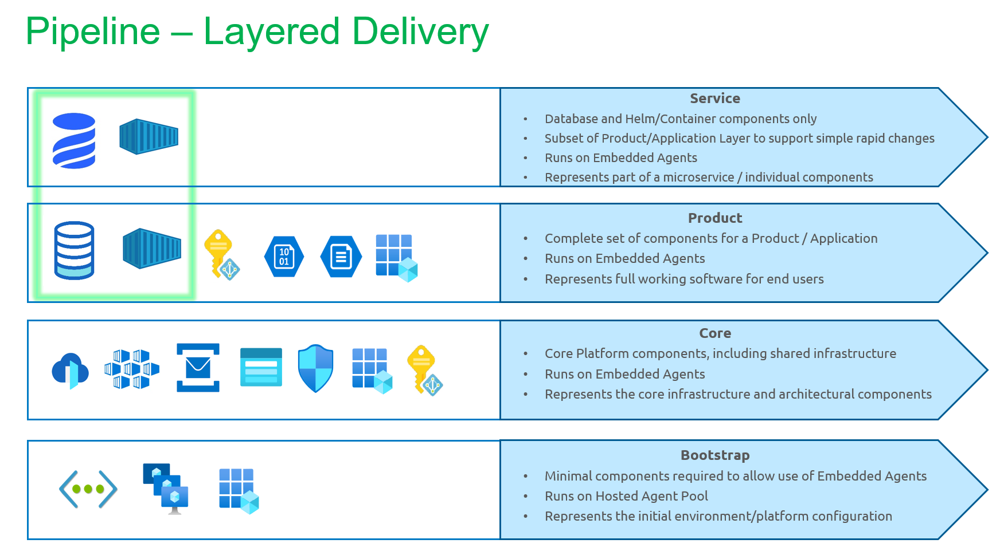

# Common Pipelines for delivery

We are an Internal Development Platform that supports the delivery and maintenance of business services and applications for a variety of consumers. As part of this, we have a range of Common Pipelines that both Platform and Delivery teams can use to build and deploy their applications to all environments. 

## Key Principles

As a business service using the Azure Developer Platform (ADP), you are defined as a Platform Tenant. That means your 'service' or 'product' is deployed onto the ADP and follow certain standards and conventions to expedite delivery.

- All Pipelines are in Azure DevOps, written _typically_ in YAML
- We support Service and Infrastructure deployments across all environments
- We use Bicep Modules to manage Infrastructure-as-Code
- All general configuration is in GitHub
- We can support pre-built packages from an external CI process, but we also have our own

## Infrastructure deployments

Infrastructure is layered into the following levels:

1. Product (Application)
_This represents an application (business service/product) and its associated infrastructure._
1. Core (Platform)
_This represents the Core Platform components, and fully shared infrastructure_
1. Bootstrap (Platform)
_The minimum we need to deliver a baseline setup._

Each level builds upon each other. So that means the **Bootstrapping** comes before the **Core**, and the **Core** before the **Products** are delivered. Finally, **Service** level, is the smallest deployment on the Platform and focuses on HELM (FuxCD) deployments and any DB Schema upgrades if required. We like to call these our **continuous-delivery pipelines**.

In each environment, there will be exactly one set of all platform-level (Core & Bootstrap) infrastructure and exactly one set of each of the product-level infrastructure configurations are deployed. Finally, the Service-level are added as the most granular. Taken together, these infrastructure levels fully constitute an application / business service.

## Application/Service Deployments

1. Service (Microservice)

The Services deployment focuses on the HELM Chart Deployments, using FluxCD. This is a GitOps approach to application deployments and may contain database schema upgrades where relevant. [This design can be found here.](https://dev.azure.com/defragovuk/DEFRA-FFC/_wiki/wikis/DEFRA-FFC.wiki/16474/GitOps-for-Azure-Kubernetes-Service) We also use this pipeline to deploy ADP Shared Services onto the AKS Cluster.
 
## The layered delivery - What's deployed by what?
The following diagram shows the deployment layers, and the types of infrastructure that might be found in a given environment including the services.  

 

| Pipeline | Description | Supported Components |
| -----  | ---------   | --------- | 
| Bootstrap | Contains pipelines used for bootstrapping e.g. setting up service connections  | VNET, Service Connections, Service Principals   | 
| Core| Contains pipelines used for install the ADP Platform Core resources e.g. AKS. These are all shared Platform components used by platform tenants.  |  AKS Cluster, Networking (Vnet, NSGs, Subnets, UDRs), Key Vaults & config, Service Bus Core, Azure Front Door, Platform Storage Accounts, PostgreSQL Flexible server, Cosmos DB, Azure Redis Cache, App Insights, Log Analytics, Container Registry, AAD Configuration (App Registrations, AAD Groups etc.), App Configuration Service Core, Managed Identities  | 
| Product | Contains pipelines used for onboarding & deploying services onto the ADP Platform (i.e. their infrastructure components)  | Service Bus - Queues, Topics & Subscriptions, Managed Identities & RBAC, Service Databases, Front Door DNS Profiles (public and private), App Configuration Key-Value Pairs, KeyVault Key-Value pairs, App Registrations & AAD Groups, Service Storage Accounts (& tables/containers, etc.) | 
| Services | Contains Service pipelines for deploying into AKS Cluster with FluxCD (GitOps Pipelines)  | Service & ADP HELM (Application) Deployments with FluxCD, Database Migrations (Liquibase?) | 

## CI Process
- TBC

