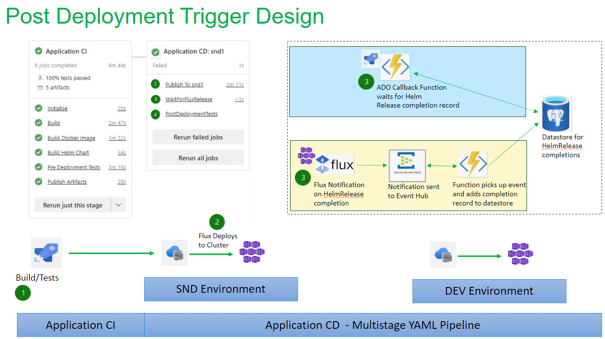

# Flux Configuration

## Flux Build Deployment Completion Trigger
**Context**: These are the findings from the ['Build Deployment completion Trigger'](./flux-configuration.md) Spike.  The goal of the findings is to be able to Execute Post deployment tests when Flux CD has completed deploying a new application​.



### **Example of how to configure Event Hub as an external source and send notifications to it:**

We can utilize the flux notification controller to dispatch events to external systems (Azure Function, Azure Event Hub, Slack,  Teams) https://fluxcd.io/flux/components/notification/

Reference:
https://github.com/fluxcd/notification-controller/blob/main/docs/spec/v1beta2/providers.md#sas-based-auth

Using SAS based authentication:

Create a secret containing the shared access key:
`kubectl create secret generic webhook-url --from-literal=address="Endpoint=sb://events-hub-adp-poc.servicebus.windows.net/;SharedAccessKeyName=flux-notifications;SharedAccessKey=an1ZOt9v90oycqy67rbcnEoXaIGecBLAH+AEhD/vy1g=;EntityPath=flux-events"`

Create a Provider resource for Event Hub:
```
apiVersion: notification.toolkit.fluxcd.io/v1beta2
kind: Provider
metadata:
  name: azureeventhub
  namespace: flux-config
spec:
  type: azureeventhub
  secretRef:
    name: webhook-url

```

Create an Alert resource for the type of Alerts we want to monitor:
```
apiVersion: notification.toolkit.fluxcd.io/v1beta2
kind: Alert
metadata:
  name: azureeventhub-alert
  namespace: flux-config
spec:
  providerRef:
    name: azureeventhub
  eventSeverity: info
  eventSources:
    - kind: HelmRelease
      name: '*'
  inclusionList:
    - ".*succeeded.*"
```

### **Example ADO Pipeline Callback task**

To make ADO pipeline wait for Flux deployment completion we can utilize the [AzureFunction@1](https://learn.microsoft.com/en-us/azure/devops/pipelines/tasks/reference/azure-function-v1?view=azure-pipelines) task.  This will allow us to call an azure function asynchronously.  The function can then poll a database ( or queue? ) and when a HelmRelease completion entry appears for the service, it will call back to the pipeline to continue:

Example AzureFunction@1 yaml:

```
stages:
  - stage: TestStage
    jobs:
      - job: TestJob
        pool: server
        timeoutInMinutes: 10
        steps:
              
          - task: AzureFunction@1
            inputs:
              function: 'https://adopipelineasyncfuncpoc.azurewebsites.net/api/AdoCallBack'
              key: '$(callBackKey)'
              method: 'POST'
              body: |
                '{
                "helmReleaseName": "ffc-demo-web-infra-post-deploy",
                "helmReleaseVersion": "4.32.30"  
                }'
              waitForCompletion: 'true'
```

[Example of Function App that uses the callback completion mode](https://learn.microsoft.com/en-us/azure/devops/pipelines/tasks/reference/azure-function-v1?view=azure-pipelines#example-of-an-azure-function-that-uses-the-callback-completion-mode)

## Configuring Flux V2 on AKS

### Enable Flux Extension on the AKS Cluster

GitOps with Flux v2 is enabled as a [cluster extension](https://learn.microsoft.com/en-us/azure/azure-arc/kubernetes/conceptual-extensions) in Azure Kubernetes Service (AKS) clusters.

The `microsoft.flux` cluster extension is installed using a bicep template [`aks-cluster.bicep`](https://github.com/DEFRA/adp-infrastructure/blob/main/infra/managed-cluster/aks-cluster.bicep) and an ADP Infra Pipeline [`platform-adp-core`](https://dev.azure.com/defragovuk/DEFRA-FFC/_build?definitionId=4407). 

Below is a snippet of the code for enabling Flux on AKS

``` bicep
fluxExtension: {
      autoUpgradeMinorVersion: true
      releaseTrain: 'Stable'
      configurationSettings: {
        'helm-controller.enabled': 'true'
        'source-controller.enabled': 'true'
        'kustomize-controller.enabled': 'true'
        'notification-controller.enabled': 'true'
        'image-automation-controller.enabled': 'false'
        'image-reflector-controller.enabled': 'false'
      }
      configurations: [ ...  
      
      ]

```

### Add Flux Customizations

After the `microsoft.flux` cluster extension has been installed, create a  `fluxConfiguration` resource that syncs the Git repository source [`adp-flux-core`](https://github.com/DEFRA/adp-flux-core) to the cluster and reconcile the cluster to the desired state. With GitOps, the Git repository is the source of truth for cluster configuration and application deployment.

The Flux configuration links Flux to the ADP Flux Git repository and defines:

* The git repository that Flux should use
* The branch you want to use e.g. main
* The root Kustomization objects to run, which will then be used to deploy the rest of workloads (core services and business applications).

Refer to the documentation for the [Flux repositories structure](/DEFRA-FFC-Project-Wiki-Homepage/Defra-Azure-Platform/Architecture/CI%2DCD,-Pipelines-&-Automation/GitOps-for-Azure-Kubernetes-Service/Repository-Setup) for details of the two Flux repositories ([`adp-flux-core`](https://github.com/DEFRA/adp-flux-core) and [`adp-flux-services`](https://github.com/DEFRA/adp-flux-services)) and folder structures.

The Flux Configuration has three Kustomizations

| Kustomization | Path    |  Purpose      |
| ------        | ------- | ----------    |
|   cluster     |  ./clusters/_<environment>_/01 |  Cluster level configurations e.g. Flux Controllers, CRDs             |
|   infra        | ./infra/_<environment>_/01 |  Core Services e.g. Nginx Plus <br/> Depends on the `cluster` Kustomization |
|   services    | ./services/_<environment>_/01 |  Business applications <br/> Depends on the `services` Kustomization |

> The Kustomizations have been configured with dependencies to ensure the Flux deployments are done in the correct sequence, starting with the `Cluster` Kustomization, followed by `Infra` and lastly `Services`.

Below is a snippet of the Kustomizations configuration from [`aks-cluster.bicep`](https://github.com/DEFRA/adp-infrastructure/blob/main/infra/managed-cluster/aks-cluster.bicep) and [`aks-cluster.parameters.json`](https://github.com/DEFRA/adp-infrastructure/blob/main/infra/managed-cluster/aks-cluster.parameters.json)

``` bicep

kustomizations: {
   cluster: {
     path: fluxConfig.clusterCore.kustomizations.clusterPath
     dependsOn: []
     timeoutInSeconds: fluxConfig.clusterCore.kustomizations.timeoutInSeconds
     syncIntervalInSeconds: fluxConfig.clusterCore.kustomizations.syncIntervalInSeconds
     validation: 'none'
     prune: true
   }
   infra: {
     path: fluxConfig.clusterCore.kustomizations.infraPath
     timeoutInSeconds: fluxConfig.clusterCore.kustomizations.timeoutInSeconds
     syncIntervalInSeconds: fluxConfig.clusterCore.kustomizations.syncIntervalInSeconds
     dependsOn: [
       'cluster'
     ]
     validation: 'none'
     prune: true
   }
   services: {
     path: fluxConfig.services.kustomizations.servicesPath
     timeoutInSeconds: fluxConfig.services.kustomizations.timeoutInSeconds
     syncIntervalInSeconds: fluxConfig.services.kustomizations.syncIntervalInSeconds
     retryIntervalInSeconds: fluxConfig.services.kustomizations.retryIntervalInSeconds
     dependsOn: [
       'infra'
     ]
     prune: true
   }
}

```

Although we have two flux Git repositories, we are using a single Flux customisation because we cannot set dependencies at the Flux Customisation level. Instead, we have a single Flux Customisation with three Kustomizations that will be deployed in sequential order `Cluster > Infra > Services`.

The _Services_ Flux configuration contains a GitRepository and a Kustomization file that points to the _Services_ Flux git repostory [`adp-flux-services`](https://github.com/DEFRA/adp-flux-services) using the path `./services/environments/<environment>/01`