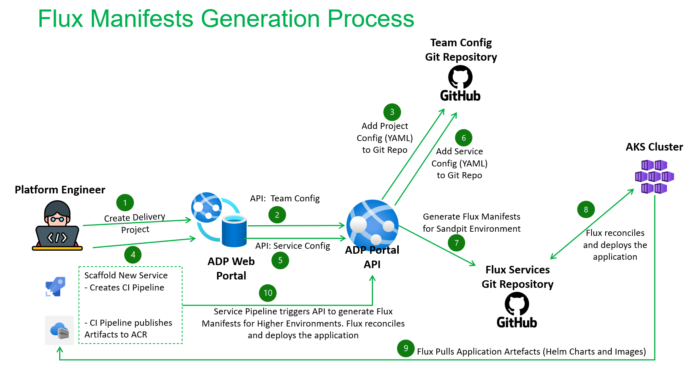

# Flux Manifests

Flux manifests are YAML files that define the desired state of your Kubernetes resources. They are essential for managing and automating the deployment of applications and infrastructure in a Kubernetes cluster.

## Why We Need Flux Manifests

- **Declarative Configuration**: Flux manifests enable you to declare the desired state of your resources, making it easier to manage and maintain configurations.
- **Version Control**: By storing manifests in a Git repository, you can track changes, roll back to previous states, and collaborate with others.
- **Automation**: Flux continuously monitors the Git repository and applies changes to the cluster, ensuring that the cluster state matches the desired state defined in the manifests.

## Types of Flux Manifests

1. Kustomization: Defines how to customize Kubernetes resources using Kustomize.
1. HelmRelease: Manages Helm charts and releases.
1. GitRepository: Specifies the source Git repository containing the manifests.
1. HelmRepository: Specifies the source Helm repository containing the manifests.
1. ImagePolicy: Specifies policies for automated image updates.
1. ImageRepository: Defines the source container image repository.

## Microsoft Flux Extension for AKS

The Microsoft Flux extension for Azure Kubernetes Service (AKS) integrates GitOps capabilities directly into AKS clusters. So rather than managing the set up of Flux, this extension is enabled and configured on the cluster. It simplifies the management of Kubernetes clusters by leveraging GitOps principles, making it easier to maintain, scale, and secure your deployments

### Flux Operator

The Flux Operator is a Kubernetes controller that manages the lifecycle of Flux CD. [It automates the installation, configuration, and upgrade of Flux controllers based on a declarative API](https://github.com/controlplaneio-fluxcd/flux-operator)

## Generating the Flux Manifests

Flux manifests are used by the Flux GitOps Operator to deploy the services into the AKS cluster. The flux manifests are generated either when scaffolding a new service using the ADP Portal or when the CD pipeline is deploying a service to a new environment (for which the flux manifests don’t exist or require updating).

1. A Delivery Project is created following the process described in [the Onboarding a delivery project section](../../../../Getting-Started/onboarding-a-delivery-project.md).  The portal will make an API POST request to the backend API to create the Team specific AD Groups to be used for RBAC.
2. The Backend API will populate the details of the teams in the Teams config repository.
   On creation of the project, the teams config will be updated (team specific AD groups).
3. The Backend API will then sync the group changes and create the AD Groups in Microsoft Entra ID. This occurs on creation and update on the delivery project information in the ADP Portal.
4. Once a Delivery Project has been created, the development teams can then scafford one or more services following the documentation in the guide [How to create a service guide](../../../../How-to-guides/Platform-Services/how-to-create-a-platform-service.md)
5. When a user submits the service template form that the engineer has completed, the portal will make API requests to the backend service.
6. The Backend service will start by writing the information to the Teams config.
7. The API will then create/update the Flux manifests for the Sandpit environments in the Flux Services repository. For upstream environments (dev, tst, pre and prd), the CI pipeline will add/update the flux manifests on demand during the deployment of the services to that environment. 
8. Flux will reconcile and deploy the application.

## Process for making changes to the Flux Templates

The flux generation process is split into two environments, Sandpit and Production. The sandpit environment will be used the core ADP Platform Team to test new enhancements and issues pertaining to scaffolder whilst the Production environment will be used for all environments used by the Development Teams to development, testing and deploying live services.
Each Flux Environment comprises of the following repositories.

• adp-teams-config:  This GitHub repository contains the configuration used to define and generate the flux manifests. The configuration is defined at tenant, environment, and service level. This GitHub repository’s visibility has been set to internal.
• adp-flux-core: This GitHub repository contains the flux manifests for deploying the cluster and platform level (core) resources e.g., Nginx Ingress controller, Azure Service Operator, Cert Manager, and other services. This GitHub repository’s visibility has been set to public.
• adp-flux-services: This GitHub repository contains the flux manifests for deploy service level resources. Each deployed microservice that is running in the cluster will have a set of flux manifests that define the configuration Flux requires to deploy the service. No manual process is required for adding the manifests. This has been automated using an API.
• ADP Portal: Users of the Portal can use a set of defined Software Backend and Frontend Templates to scaffold a new service. This leverages an API that scaffolds updates the configuration in the repository adp-teams-config and then scaffolds the flux manifests in the repository adp-flux-services.

Github Organisations used for Flux Manifests Scaffolding

Sandpit - the defra adp sandpit org is used by the platform team.
Production - main DEFRA Github Org

Each of these will contain the following repositories

- adp-teams-config
- adp-flux-core
- adp-flux-services
