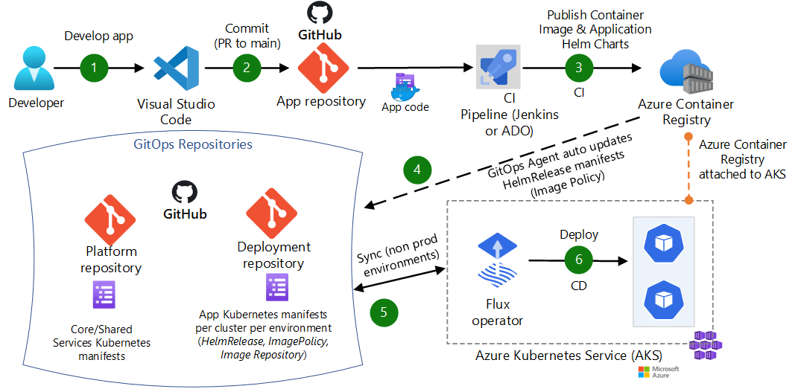

# GitOps for AKS

## GitOps Principles

GitOps is a set of principles for operating and managing a software system. Below are the principles of GitOps

According to [GitOps principles](https://opengitops.dev/#principles), the desired state of a GitOps-managed system must be:

1. **Declarative**: A system that GitOps manages must have its desired state expressed declaratively. The declaration is typically stored in a Git repository.
2. **Versioned and immutable**: The desired state is stored in a way that enforces immutability and versioning, and retains a complete version history.
3. **Pulled automatically**: Software agents automatically pull the desired state declarations from the source.
4. **Continuously reconciled**: Software agents continuously observe actual system state and attempt to apply the desired state.

### Flux v2

You can use either [Flux](https://fluxcd.io/) and [Argo CD](https://argo-cd.readthedocs.io/) as GitOps operators for AKS. Both are [Cloud Native Computing Foundation (CNCF)](https://www.cncf.io/) projects that are widely used. Refer to the Microsoft documentation [GitOps for Azure Kubernetes Service](https://learn.microsoft.com/en-us/azure/architecture/example-scenario/gitops-aks/gitops-blueprint-aks).

Flux V2 is the GitOps operator that will be implemented for the ADP Platform.

_Draft - Further discussion required on step 4_

The CI pipeline uses either ADO Yaml Pipelines or Jenkins for build. For deployment, it uses Flux as the GitOps operator to pull and sync the app. The data flows through the scenario as follows:

1. The app code is developed by using an IDE such as Visual Studio Code.
2. A Pull request is raised to merge the changes into the main branch.

- CI pipeline will deploy the changes to DEV and run automation tests as part of the PR review process.
- PR approvers review changes
- The app code is committed to a GitHub repository if CI Build is successful, the automation tests have passed and PR has been approved.

> Updating the versions of the application in the Helm chart can be done automatically by the CI or manually by the developer before raising the PR.

3. The CI pipeline builds a container image from the app code and pushes the container image to the DEV environment Azure Container Registry.
4. The Flux operator detects configuration drift in the Git repository and pulls the configuration changes. An image policy is used by Flux to scan the ACR repository for new images.
5. Flux uses manifest files to deploy the app to the AKS cluster.

### Promoting Changes across Environments

Refer to the Wiki page [Application Deployments](./application-deployments.md)

### Core/Shared Services

Flux V2 will be used to bootstrap the baseline configuration of each cluster. The baseline configuration will comprise of the core services e.g.

- [Nginx Plus](https://docs.nginx.com/nginx-ingress-controller/intro/nginx-plus/)
- [Azure AD workload identity](https://learn.microsoft.com/en-us/azure/aks/workload-identity-overview)
