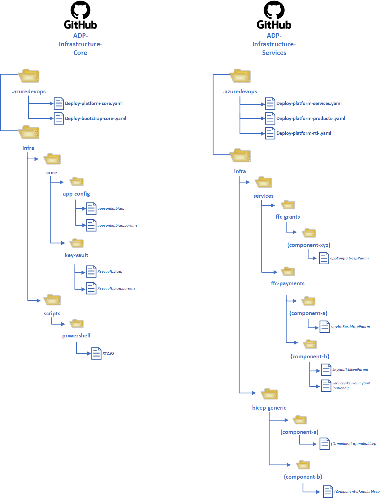

# Pipeline Naming Conventions & Structures

All pipelines on the Platform will have a specific set of naming conventions to ensure consistency, standardization and readability. This article describes the naming conventions of ADO Pipelines and associated YAML files.

## **The conventions**

_platform-`<project>`-`<purpose>`_

For the ADO Pipelines: '_Platform_' highlights the fact it is a Platform pipeline. _'Project'_ is always ADP for the Platform. _'Purpose'_ is typically either: _core, bootstrap, product or service._  For the YAML files, we try and maintain the same naming convention, except all files should be prefixed with: _'deploy'_ or _'ci'_.

### Azure DevOps Pipelines

Based on the types of pipelines and their purposes, the following naming conventions have been identified for ADO (UI Display Name):

**Core Infrastructure**

- platform-adp-core
- platform-adp-bootstrap-serviceconnections

**Products**

- platform-adp-products

**Services**

- platform-adp-sevices
  ` `

The ADO Pipelines will all be created in the [existing DEFRA-FFC ADO project under the ADP Subfolder](https://dev.azure.com/defragovuk/DEFRA-FFC/_build?definitionScope=%5CADP).

### Pipeline Matrix

| Folder    | Description                                                                                                                                      | Pipelines                                                                                                     | YAML Pipelines                                                                                                                                                    |
| --------- | ------------------------------------------------------------------------------------------------------------------------------------------------ | ------------------------------------------------------------------------------------------------------------- | ----------------------------------------------------------------------------------------------------------------------------------------------------------------- |
| Bootstrap | Contains pipelines used for bootstrapping e.g. setting up service connections                                                                    | [platform-adp-bootstrap-serviceconnections](https://dev.azure.com/defragovuk/DEFRA-FFC/_build?definitionId=4347) | [deploy-platform-bootstrap-serviceconnections](https://github.com/DEFRA/adp-infrastructure/blob/main/.azuredevops/deploy-platform-bootstrap-serviceconnections.yaml) |
| Core      | Contains pipelines used for install the ADP Platform Core resources e.g. AKS. These are all shared Platform components used by platform tenants. | [platform-adp-core](https://dev.azure.com/defragovuk/DEFRA-FFC/_build?definitionId=4407)                         | [deploy-platform-core](https://github.com/DEFRA/adp-infrastructure/blob/main/.azuredevops/deploy-platform-core.yaml)                                                 |
| Product   | Contains pipelines used for onboarding & deploying services onto the ADP Platform (i.e. their infrastructure components)                         | platform-adp-products (not implemented yet)                                                                   | deploy-platform-products                                                                                                                                          |
| Services  | Contains Service pipelines for deploying into AKS Cluster with FluxCD (GitOps Pipelines)                                                         | platform-adp-services (not implemented yet)                                                                   | deploy-platform-services                                                                                                                                          |

## **Folder Structure - ADP Infrastructure**

Core infrastructure will reside within [GitHub in ADP Infrastructure](https://github.com/DEFRA/adp-infrastructure). There are planned to be other infrastructure and FluxCD repos, of which the design is currently in progress. It is proposed that the infrastructure that is dedicated for our tenant services (products) will reside with ADO-Infrastructure-Services*.

All infrastructure will be within the 'infra' folder. '_Core_' designates the **Platform Core Shared Infrastructure** that is used by all the platform projects & services (tenants). '_Services_' designates that the folder contains only infrastructure and configuration dedicated to that project/service (tenant).

Each Module instantiation file will be within it's own folder, broken down with the following conventions below (as per the Bicep Module registry convention):

- The following folder structure for Modules: **Infra**/`<module-name>`/`<module-name>`.`<extension>`
- The file extension will either be: .**bicep** or .**biceparams** for infrastructure modules.
- For PowerShell and PowerShell modules the extension will be: .**ps1** or **psm1**
- For .yaml for YAML Files (i.e. ADO Pipelines)

 

### Infrastructure repository diagram for ADP-Infra-Core and ADP-Infra-Services

