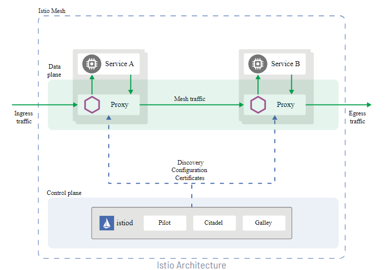
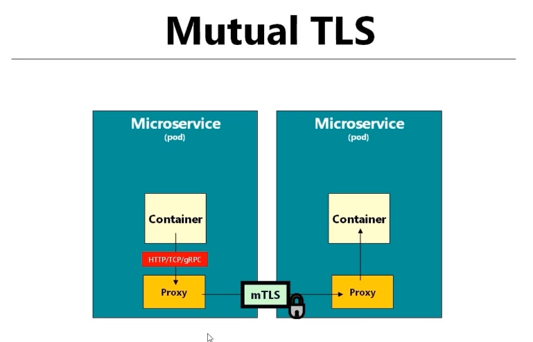
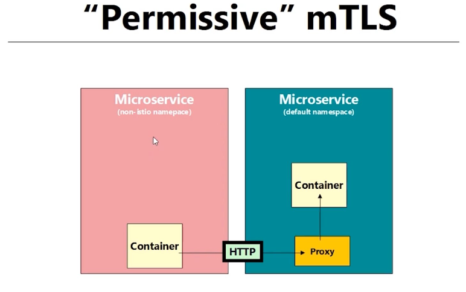
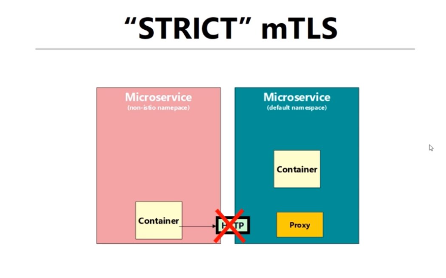
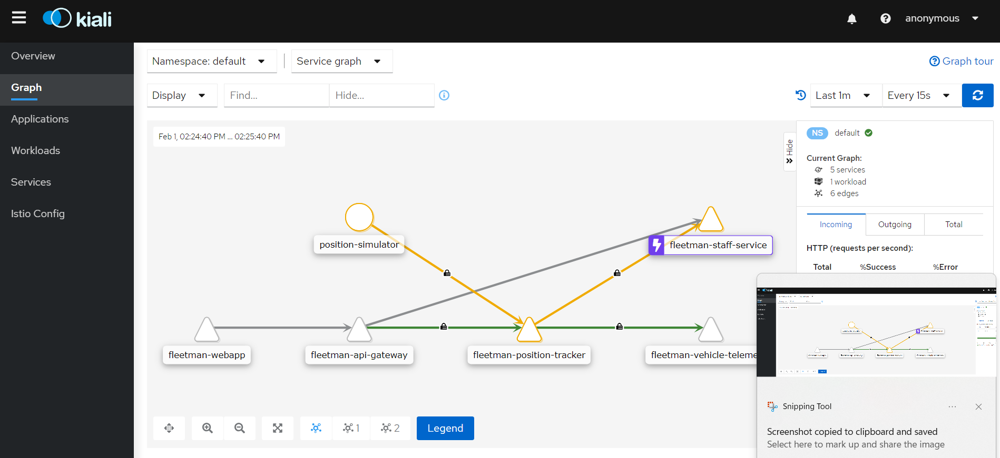
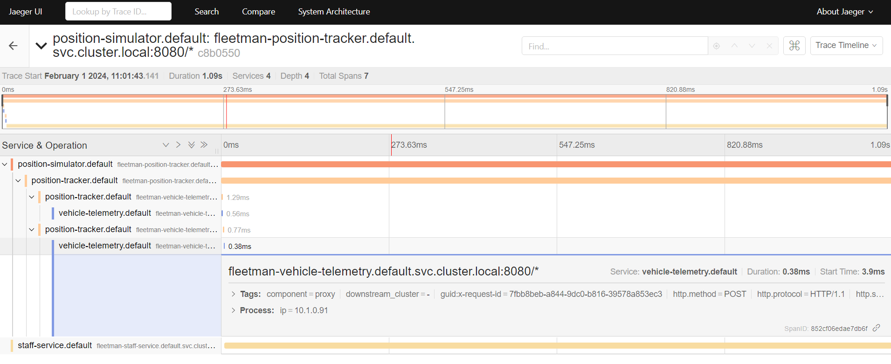

## **Istio Architecture**

!!! note "TODO"
    This page is a work in progress and will be updated in due course.

This document details the findings of Istio Service Mesh, including some features and integration with Flux.

An Istio service mesh is logically split into a data plane and a control plane.

The data plane is composed of a set of intelligent proxies (Envoy) deployed as sidecars. These proxies mediate and control all network communication between microservices. They also collect and report telemetry on all mesh traffic.

The control plane manages and configures the proxies to route traffic.

The following diagram shows the different components that make up each plane:



Reference: [Istio Architecture](https://istio.io/latest/docs/ops/deployment/architecture/)

## **Installation**

Because we are using Nginx as our ingress controller, the following document was referenced to code the installation in [adp-flux-core](https://github.com/DEFRA/adp-flux-core/compare/istio-poc?expand=1) and [adp-flux-services](https://github.com/DEFRA/adp-flux-services/compare/istio-poc?expand=1).
[NGINX Ingress Controller and Istio Service Mesh](https://docs.nginx.com/nginx-ingress-controller/tutorials/nginx-ingress-istio/)


## **Features**

- ### **MTLS**

  Istio automatically configures workload sidecars to use mutual TLS when calling other workloads. By default, Istio configures the destination workloads using PERMISSIVE mode. When PERMISSIVE mode is enabled, a service can accept both plaintext and mutual TLS traffic. In order to only allow mutual TLS traffic, the configuration needs to be changed to STRICT mode.

Reference: [MTLS](https://istio.io/latest/docs/tasks/security/authentication/mtls-migration/)







Here is an example of applying STRICT mtls at the namespace level:

```
apiVersion: security.istio.io/v1beta1
kind: PeerAuthentication
metadata:
  name: default
  namespace: ffc-demo
spec:
  mtls:
    mode: STRICT
```

- ### **Circuit Breaking**

  Circuit breaking is an important pattern for creating resilient microservice applications. Circuit breaking allows you to write applications that limit the impact of failures, latency spikes, and other undesirable effects of network peculiarities.

  Reference: [Circuit breaking](https://istio.io/latest/docs/tasks/traffic-management/circuit-breaking/)

  Istio uses `DestinationRule` to configure circuit breakers.

  Here is a sample `DestinationRule` with circuit breaker rules:

```
apiVersion: networking.istio.io/v1alpha3
kind: DestinationRule
metadata:
  name: httpbin
spec:
  host: httpbin
  trafficPolicy:
    connectionPool:
      tcp:
        maxConnections: 1
      http:
        http1MaxPendingRequests: 1 #  limits the number of requests that can be queued
        maxRequestsPerConnection: 1 # Previous request has to complete before next one is sent
    outlierDetection:
      consecutive5xxErrors: 2
      interval: 1s
      baseEjectionTime: 30s
      maxEjectionPercent: 100
```

- ### **Fault Injection**

  While Envoy sidecar/proxy provides a host of failure recovery mechanisms to services running on Istio, it is still imperative to test the end-to-end failure recovery capability of the application as a whole. Misconfigured failure recovery policies (e.g., incompatible/restrictive timeouts across service calls) could result in continued unavailability of critical services in the application, resulting in poor user experience.

  Istio enables protocol-specific fault injection into the network, instead of killing pods, delaying or corrupting packets at TCP layer. Our rationale is that the failures observed by the application layer are the same regardless of network level failures, and that more meaningful failures can be injected at the application layer (e.g., HTTP error codes) to exercise the resilience of an application.

  Operators can configure faults to be injected into requests that match specific criteria. Operators can further restrict the percentage of requests that should be subjected to faults. Two types of faults can be injected: delays and aborts. Delays are timing failures, mimicking increased network latency, or an overloaded upstream service. Aborts are crash failures that mimic failures in upstream services. Aborts usually manifest in the form of HTTP error codes, or TCP connection failures.

Reference: [Fault Injection](https://istio.io/latest/docs/tasks/traffic-management/fault-injection/), https://imesh.ai/blog/traffic-management-and-network-resiliency-with-istio-service-mesh/

- ### **Other Features**


  - [Traffic Management](https://istio.io/latest/docs/tasks/traffic-management/)
  - [Security](https://istio.io/latest/docs/tasks/security/)
  - [Policy Enforcement](https://istio.io/latest/docs/tasks/policy-enforcement/)
  - [Observability](https://istio.io/latest/docs/tasks/observability/)
- ### **Observability tools**


  - **Kiali**
    Kiali is an observability console for Istio with service mesh configuration and validation capabilities. It helps you understand the structure and health of your service mesh by monitoring traffic flow to infer the topology and report errors.

  )

  Reference: https://kiali.io/ , https://istio.io/latest/docs/ops/integrations/kiali/

  - **Jaeger**
    Jaeger is software for distributed tracing, which can help monitor and troubleshoot a complex microservices environment.

  

  Reference: https://www.jaegertracing.io/ , https://istio.io/latest/docs/tasks/observability/distributed-tracing/jaeger/

## **Multi-Cluster setup**

It is possible to have a multi-cluster setup for Istio.  https://istio.io/latest/docs/setup/install/multicluster/ .

Our setup is slightly different than the instructions because we are using Niginx Ingress Controller, so we will have to investigate how to get Multi-Cluster setup with Nginx and Istio.

## **[Istio Supported Releases](https://istio.io/latest/docs/releases/supported-releases/)**

## **Additional Notes:**

- To enable end to end TLS, we will need Istio in place.  We will need to investigate how to configure end to end TLS with **Azure Frontdoor>Nginx>Istio**
- There is also a [Kiali plugin](https://janus-idp.io/plugins/kiali/) available for Backstage, which we should look into and implement if it's any good.
