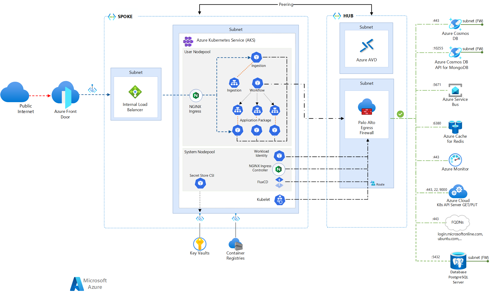

# Microservices & AKS

This document details the example microservice architecture that is being developed on the Platform. It will detail the logic and physical separation between Clusters, Node Pools, Nodes, Namespaces and Pods and how they map to projects and programmes.

## Requirements

- Logical and Physical separation between **environments, projects & programmes**
- Allow for individual scalability and ensure other projects and programmes cannot starve other resources (resource limits and quotas)

## Decisions & Outcomes

- The **System** and **User Nodepools** will be separated.
- The **System Nodepool** will only contain system resources (_Flux, NGINX, Workload ID etc._)
- Programmes will have **separate Nodepools**, per programme (BBaT, FCP, etc.) or specific resource requirements and demands
- There will be an individual **Namespace** per project in a given Nodepool (_Project A, Project B, namespace etc._)
- **Namespaces** will have resource and quota limits defined
- [NGINX](https://www.nginx.com/resources/glossary/kubernetes-ingress-controller/#:~:text=The%20NGINX%20Ingress%20Controller%20is,that%20require%20ingress%20load%20balancing.) Plus is the Ingress Controller (load balancing internal traffic) with a Private IP
- Azure Front Door is the edge WAF and CDN, with Public IP
- Node (VM) sizes to be defined / used existing FCP convention
- The ILB defined below allows a [Private Link Service](https://learn.microsoft.com/en-us/azure/frontdoor/standard-premium/how-to-enable-private-link-internal-load-balancer) from the AFD to connect into [AKS](https://medium.com/microsoftazure/connect-azure-front-door-premium-to-an-aks-app-origin-with-private-link-5978341c2650)

### Examples

The below diagram generally illustrates these requirements and separation. The namespaces provide the Logical Separation, and the separate Clusters provide Physical Separation. An example service is illustrated below, with the types of resources that can be deployed, how they integrate with the Hub/Spoke networking and Egress through the outbound firewall - CCoE Managed Palo Alto's.

