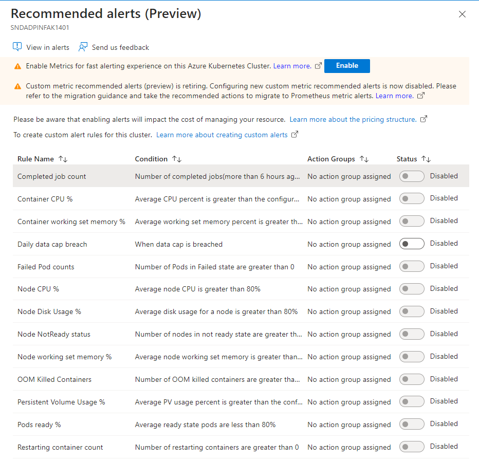

# Alerts in ADP

Azure Monitor for containers now [includes recommended alerts](https://azure.microsoft.com/en-gb/updates/ci-recommended-alerts/).  These preconfigured metrics alerts enable monitoring the system resources when they are running on peak capacity or hitting failure rates.

## Metric Alert Rules

Metric alerts in Azure Monitor proactively identify issues related to system resources of your Azure resources, including monitored Kubernetes clusters. 

> Container insights provides preconfigured alert rules so that we will use those as starting point...

> Container insights in Azure Monitor now supports alerts based on `Prometheus metrics`, and **metric rules will be retired on March 14, 2026**. If you already use alerts based on custom metrics, you should migrate to Prometheus alerts and disable the equivalent custom metric alerts. As of August 15, 2023, **you will no longer be able to configure new custom metric recommended alerts using the portal**.

[Metric alert rules in Container insights (preview)](https://learn.microsoft.com/en-us/azure/azure-monitor/containers/container-insights-metric-alerts?tabs=arm-template%2Cazure-portal)

### Prometheus rules

[Prometheus alert rules](https://learn.microsoft.com/en-us/azure/azure-monitor/alerts/alerts-types#prometheus-alerts) use metric data from your Kubernetes cluster sent to Azure Monitor managed service for Prometheus.

> Enable Prometheus Alert Rules by deploying the community and recommended alerts using the [Bicep template](https://aka.ms/azureprometheus-alerts-bicep). Follow the README.md file in the same folder for how to deploy.
https://github.com/Azure/prometheus-collector/blob/main/AddonBicepTemplate/AzureMonitorAlertsProfile.bicep

### Configure alertable metrics in ConfigMaps

The tutorial below specifies how you can [configure the alertable metrics in ConfigMaps](
Configure alertable metrics in ConfigMaps).

## Additional Documentation
- [Metric alert rules in Container insights (preview)](https://learn.microsoft.com/en-us/azure/azure-monitor/containers/container-insights-metric-alerts?tabs=bicep%2Cazure-portal)

## Flux Alerts

[Flux Alerts](https://fluxcd.io/flux/monitoring/alerts/) are configured to notify teams about the status of their GitOps pipelines.

The Flux controllers emit Kubernetes events whenever a resource status changes. You can use the notification-controller to forward these events to Slack, Microsoft Teams, Discord and others. The [notification controller](https://fluxcd.io/flux/components/notification/) is part of the default Flux installation

The following alerts will be configured for the following scenarios:

- Reconciliation failures in the cluster
- A new version of an app was deployed and if the deployment is healthy

### Slack Integration