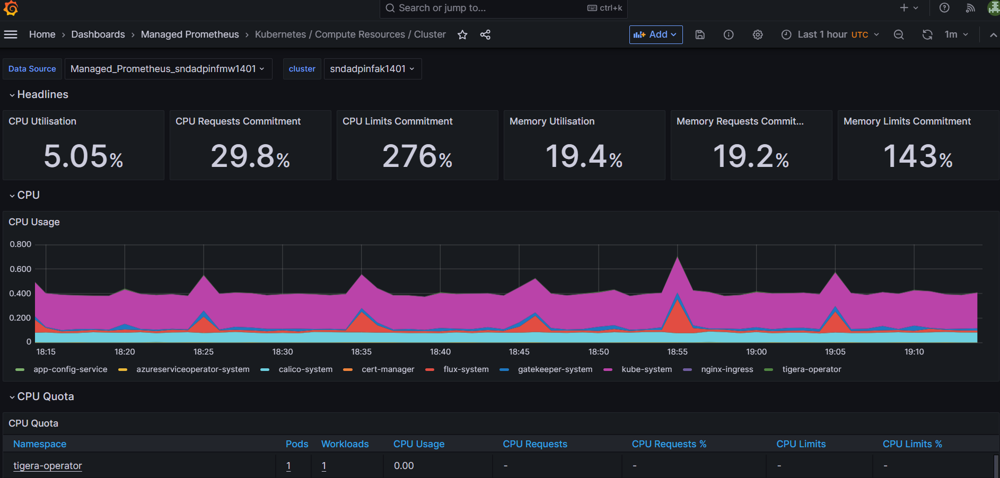
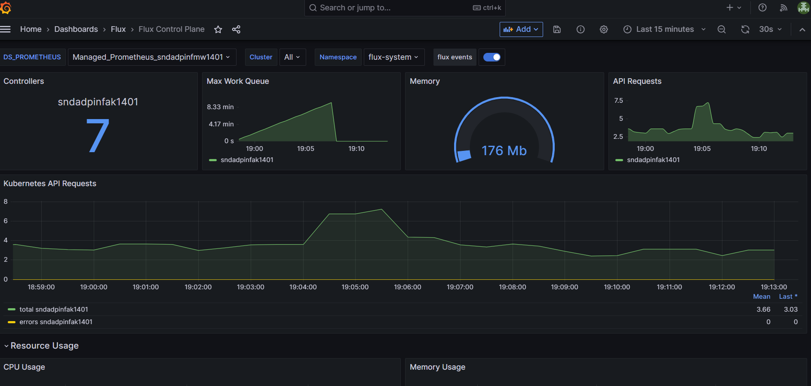

# Automated Monitoring Implementation - Enable Prometheus Logs

This section details how the AKS Prometheus logs were enabled via Automation.  The following documents were referenced:

https://learn.microsoft.com/en-us/azure/azure-monitor/containers/prometheus-metrics-enable?tabs=bicep

https://github.com/slavizh/BicepTemplates/blob/main/monitor-prometheus/aks-resources.bicep

These are the steps that were carried out:

1. The 'Monitoring Data Reader' role was given to the Grafana system assigned identity on the Azure Monitor Workspace, so Grafana can query metrics. [Bicep Template](https://github.com/DEFRA/adp-infrastructure-core/blob/07a0b86ef98bfdb1c2564055faa4350a62cbd786/infra/core/env/managed-cluster/.bicep/prometheus-logs-requisite-resources.bicep#L46-L53)

2. A Data Collection Rule Association was created between the AKS Cluster and the Azure Monitor Workspace. [Bicep Template](https://github.com/DEFRA/adp-infrastructure-core/blob/07a0b86ef98bfdb1c2564055faa4350a62cbd786/infra/core/env/managed-cluster/.bicep/prometheus-logs-requisite-resources.bicep#L26-L33)

3. The default metrics prometheusRuleGroups provided by Microsoft were added to the automation in order to populate the Dashboards in Grafana.  [Bicep Template](https://github.com/DEFRA/adp-infrastructure-core/blob/main/infra/core/env/managed-cluster/.bicep/prometheus-rule-groups.bicep)

4. The azureMonitorProfile metrics were enabled in the AKS Bicep Module [Bicep Template](https://github.com/DEFRA/adp-infrastructure-core/blob/07a0b86ef98bfdb1c2564055faa4350a62cbd786/infra/core/env/managed-cluster/aks-cluster.bicep#L296)

**Prometheus Log Retention**
Managed Prometheus includes 18 months of data retention. This is included as part of the service and there is no additional charge for storage and retention.

https://azure.microsoft.com/en-gb/updates/general-availability-azure-monitor-managed-service-for-prometheus/ (Opens in new window or tab)

https://techcommunity.microsoft.com/t5/azure-observability-blog/introducing-azure-monitor-managed-service-for-prometheus/ba-p/3600185 (Opens in new window or tab)

**Managed Prometheus Dashboard example:**

# Automate creation of Flux Dashboards

This section details how the Flux Dashboard creation and population was automated.  The following document was referenced:

https://learn.microsoft.com/en-us/azure/azure-arc/kubernetes/monitor-gitops-flux-2

These are the steps that were carried out:

1. The 'Grafana Admin' permission was granted to the ADO SSV3 (ADO-DefraGovUK-AAD-ADP-SSV3) service principal on the Azure Managed Grafana instance. This is required to allow the pipeline to create the Dashboards in Grafana

2. A PowerShell script was created to check if the 'Flux' folder and the new dashboards exist. If they don't exist the script will create them. [PowerShell Script](https://github.com/DEFRA/adp-infrastructure-core/blob/main/infra/core/env/scripts/New-FluxDashboards.ps1)

   The Dashboard json templates were taken from:
   [GitOps Flux - Application Deployments Dashboard](https://github.com/Azure/fluxv2-grafana-dashboards/blob/main/dashboards/GitOps%20Flux%20-%20Application%20Deployments%20Dashboard.json)
   [Flux Control Plane](https://github.com/Azure/fluxv2-grafana-dashboards/blob/main/dashboards/Flux%20Control%20Plane.json)
   [Flux Cluster Stats](https://github.com/Azure/fluxv2-grafana-dashboards/blob/main/dashboards/Flux%20Cluster%20Stats.json)

3. The 'Reader' permission was granted to the Grafana system assigned identity on the environment subscription. e.g. AZD-ADP-SND1

4. Configure Azure Monitor Agent to scrape the Azure Managed Flux metrics by creating a configmap.  This change was made in the [adp-flux-core](https://github.com/DEFRA/adp-flux-core/blob/main/core/grafana/configmap.yaml) repository.

[SND1 Grafana Instance](https://ssvadpinfmg3401-apa8eed9b2hsc2an.suk.grafana.azure.com)

**Flux Dashboard Example:**
