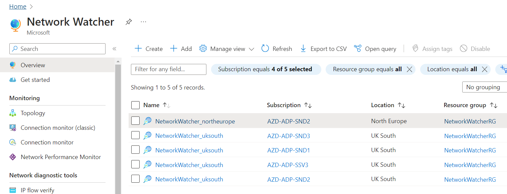

# Network Watcher

[Azure Network Watcher](https://learn.microsoft.com/en-us/azure/network-watcher/network-watcher-overview) provides a suite of tools to monitor, diagnose, view metrics, and enable or disable logs for the ADP Platform, specifically, the AKS Clusters.

> Network Watcher is enabled automatically in a virtual network's region when we create or update the virtual network in a subscription.

The Network Watcher resource in each ADP Platform subscription and region is created in the `NetworkWatcherRG` resource group.

Below is a screenshot for Network Watcher instances in the Sandpit environments.

## NSG Flow Logs

Flow Logs are enabled for the NSGs associated with AKS Cluster subnets. Flow Logs are vital to monitor, manage, and know the ADP Platform virtual networks (one per environment) so that they can protected and optimised. They enable tracking and being able to monitor the following:
- Current state of the network
- Who is connecting, and where users are connecting from.
- Which ports are open to the internet
- What network behavior is expected, what network behavior is irregular, and when sudden rises in traffic happen.

> Network Security Group (NSG) Flow Logs **Retention Period** is set to 30 days.

> Retention is available only if you use general-purpose v2 storage accounts. _An ADP Platform storage account has been created in each ADP subscription for the flow logs_.

## VNET Flow Logs

Network Watcher VNet flow logs capability overcomes some of the [existing limitations of NSG flow logs](https://learn.microsoft.com/en-us/azure/network-watcher/vnet-flow-logs-overview#vnet-flow-logs-compared-to-nsg-flow-logs). e.g. VNet flow logs avoid the need to enable multi-level flow logging such as in cases of NSG flow logs where network security groups are configured at both subnet & NIC.

> VNet flow logs is currently in PREVIEW. So will not be implemented until it is GA. The [preview version is not the available](https://learn.microsoft.com/en-us/azure/network-watcher/vnet-flow-logs-overview#availability) in UK South and UK West regions.

