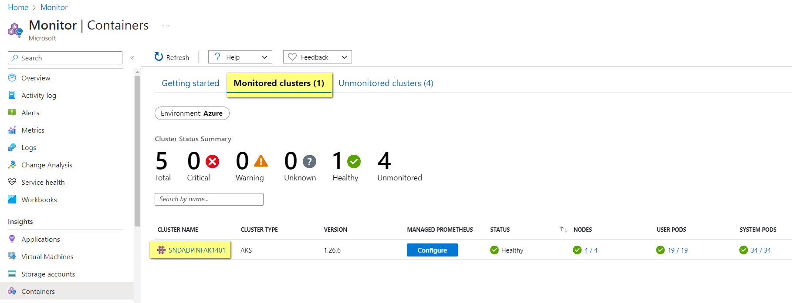
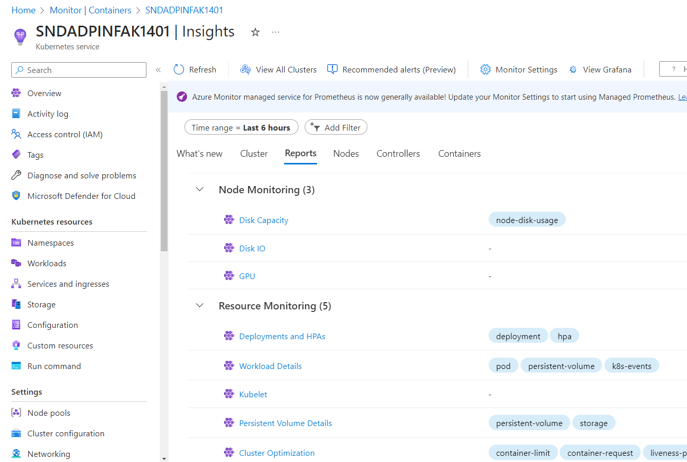
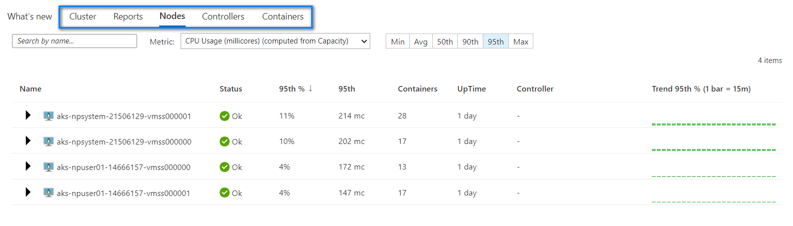
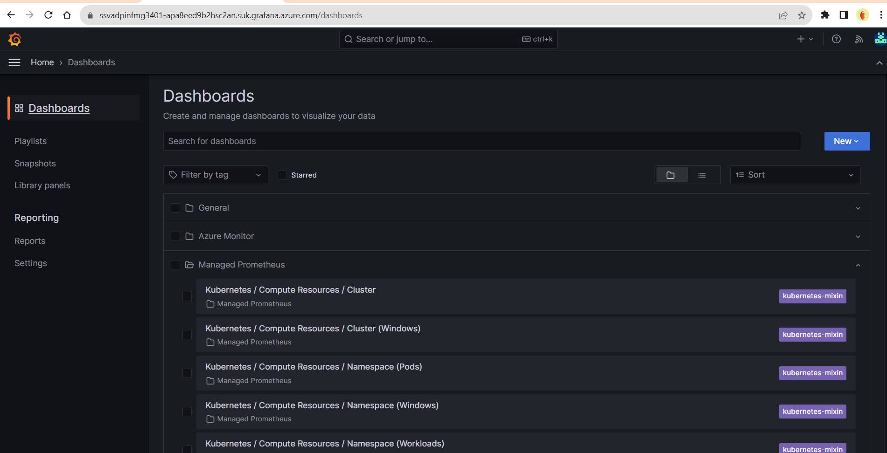

# Monitoring

Azure Monitor will be used to monitor the health and performance of the Kubernetes clusters and the workloads running on them. 

The AKS Cluster generates metrics (`Platform and Prometheus Metrics`) and logs (`Activity and Resource Logs`), refer to [Monitoring AKS data reference](https://learn.microsoft.com/en-us/azure/aks/monitor-aks-reference) for detailed information. Custom metrics will be [enabled automatically](https://learn.microsoft.com/en-us/azure/azure-monitor/containers/container-insights-onboard#authentication) since the AKS cluster uses  [managed identity authentication](https://learn.microsoft.com/en-us/azure/azure-monitor/containers/container-insights-onboard#authentication).

_Source:_ https://learn.microsoft.com/en-us/azure/aks/monitor-aks

The diagram below shows the different levels of monitoring.

_Source_: https://learn.microsoft.com/en-us/azure/azure-monitor/containers/monitor-kubernetes

## Container Insights
Azure Monitor now offers a unified cloud native offering for Kubernetes monitoring
- Azure Monitoring Managed Service for Prometheus
- Azure Monitor Container Insights
- Azure Managed Grafana

Container Insights stores its data in a `Log Analytics workspace`. Therefore an ADP  Platform Log Analytics Workspace has been created to store the AKS metrics and logs.

[Enable Container insights for Azure Kubernetes Service (AKS) cluster](https://learn.microsoft.com/en-us/azure/azure-monitor/containers/container-insights-enable-aks?tabs=azure-cli)

After enabling Container Insights, you will be able to view the AKS Cluster in the list of monitored clusters.

There are many reports available for Node Monitoring, Resource Monitoring, Billing, Networking and Security.

The diagram below shows the insights on the Nodes. The other tabs when clicked would show insights for the Cluster, Controllers or Containers.

## Azure Managed Grafana

There are many benefits to using the managed services, such as, automatic authentication and authorisation setup based on Azure AD identities and pre-built roles (Grafana Admin, Grafana Editor and Grafana Viewer). The managed Grafana service also comes with the capability to integrate with various Azure data sources through an Azure managed identity and RBAC permissions on your subscriptions.  It also comes with default Grafana Dashboards as a base.

The managed Grafana services has been installed as a shared resource in the SSV3 and SSV5 subscriptions, which are in the O365_DefraDEV and DEFRA Tenants respectively. SSV3 is used for the sandpit environments whilst SSV5 will be used for all environments in the DEFRA Tenant. These are DEV, DEMO, PRE and PROD.

### Implementation of the Managed Grafana Instance

1. Create an Azure Managed Grafana instance as a Shared resource (in SSV3 or SSV5)
   a. Create and configure an environment specific Azure Monitor workspace
   b. Link the Azure Monitor workspace to the Grafana instance
1. Enable Prometheus metrics collection by adding the AKS cluster to the monitored clusters
   a. Define alerts
1. Create Prometheus rule groups:  [Bicep template](https://github.com/Azure/prometheus-collector/blob/main/AddonBicepTemplate/AzureMonitorAlertsProfile.bicep)

## Azure Monitoring Managed Service for Prometheus

[Azure Monitor managed service for Prometheus](https://learn.microsoft.com/en-us/azure/azure-monitor/essentials/prometheus-metrics-overview) is a fully managed Prometheus-compatible service that supports industry standard features such as PromQL, Grafana dashboards, and Prometheus alerts. 

[Azure Monitor managed service for Prometheus overview diagram](https://techcommunity.microsoft.com/t5/azure-observability-blog/general-availability-azure-monitor-managed-service-for/ba-p/3817973)

This service requires configuring the metrics addon for the Azure Monitor agent, which sends data to Prometheus. 
Azure Monitor managed service for Prometheus GA 23 May 2023.
[General Availability: Azure Monitor managed service for Prometheus](https://azure.microsoft.com/en-gb/updates/general-availability-azure-monitor-managed-service-for-prometheus/)

