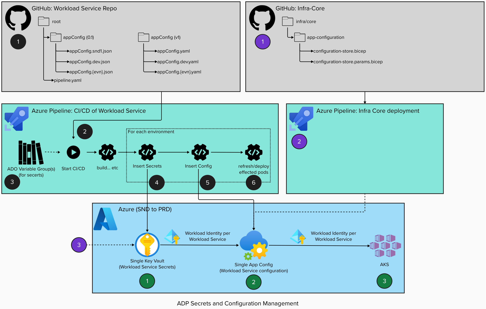
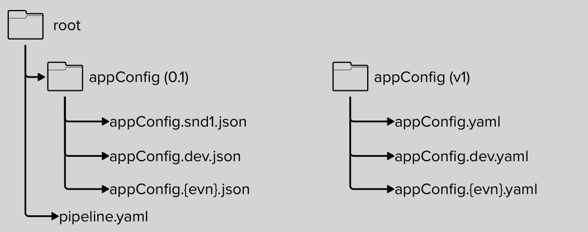

# Secrets & Configuration

## Solution Overview



Azure Architecture (green), per ADP environment:

1. A single key vault which will be used by all business services to store their workload service's secrets. Each secret within this key vault will be RBAC controlled to selected Workload identity of the Workload service.
2. A single App Configuration will store the configuration and links to key vault secrets for all business services and their workload services.
3. Within the helm charts of each workload service, the App Configuration provider must filter via the label detailing the Workload Services name to get the applications new configuration. This will be applied to the AKS via flux.

Inserting developer provided service secrets & configuration (black):

1. Configuration of values and linking to key vault will be defined is the service repos. Within a appConfig folder at the root. (see section on Defining developer provided service secrets & configuration
2. When the CI/CD pipeline is ran to build and deploy the workload service it will include these configuration files. The pipeline will provide an option to only push the configuration if needed.
3. ADO Variable Groups will be used for the developers to define the secrets of their services which are not common or platform secrets (see ADO Variable Groups for Secrets)
4. Secrets will be retrieved from the environment business service's ADO Variable Group but filtering on secrets which match the workload service name. Resulting in only the required secrets for the selected service being pushed into key vault.
   - For any new secret in the key vault should have BBAC permissions assigned to allow the workload service's workload identity get the secret and allow the technical lead group of the business service to get & view the secret.
5. Compile the appConfig files into a useable state (token replace, etc). Pushes the transformed appConfig into App Config within the chosen environment.
6. Restart or deploy effected pods to allow configuration to be used by the application.

Inserting common/ platform provided secrets & configuration for services to use (purple):

1. Inside the ADP Infra Core on common platform configuration configuration and links key vaulted secrets will be defined as parameters within the App Configurations bicep params template.
2. It will be deployed to the app configuration via the Infra Core pipeline in the same way any other infrastructure would be. These configurations will be assigned to label of “common”.
3. In order to get common secrets into key vault ADP Platform team will need to input them manually in each environments key vault when necessary.

## Defining developer provided service secrets & configuration



### 0.1 - 1st pass

```
 [
        {
            "key": "Logging:LogLevel:Debug",
            "value": "true",
            "label": "{{serviceName}}",
            "content_type": "",
            "tags": {}
        },
        {
            "key": "exampleConfig",
            "value": "true",
            "label": "{{serviceName}}",
            "content_type": "",
            "tags": {}
        },
        {
            "key": "exampleConfig2",
            "value": "Hello World! Welcome to {{serviceName}}, {{env}}!",
            "label": "{{serviceName}}",
            "content_type": "",
            "tags": {}
        },
        {
            "key": "exampleSecret",
            "value": "{\"{{resourceid}}/{{servicename}}-examplesecret\"}",
            "label": "{{serviceName}}",
            "content_type": "{{keyVaultContentType}}",
            "tags": {}
        }
]

```

### 1.0 - Ideal solution

Example appConfig.yaml

```
- key: Logging:LogLevel:Debug
  value: "true"
- key: exampleConfig
  value: "true" 
- key: exampleConfig2
  value: Hello World! Welcome to {{serviceName}}, {{env}}!
- key: exampleSecret
  value: "{{servicename}}-examplesecret"
  type: "keyvault"
```

Example appConfig.dev.yaml

```
- key: exampleConfig3
  value: My dev secret
```

Example appConfig.test.yaml

```
- key: exampleConfig3
  value: My test secret
```

### ADO Variable Groups for Secrets

ADO Variable Groups will be created per environment per business service (namespace) and be created automatically at part of the business services setup.

This will be used for each services secrets following this format {program}-{project}-{env}. For example:

- ffc-grants-snd1
- ffc-grants-dev
- ffc-grants-test
- ffc-grants-pre
- ffc-grants-prd

For secrets within these variable groups they will need to fellow this naming convention of {program}-{project}-{service}-{var name}. For example:

- ffc-gants-frontend-apikey1
- ffc-gants-frontend-mysecret

## Developer Configuration
