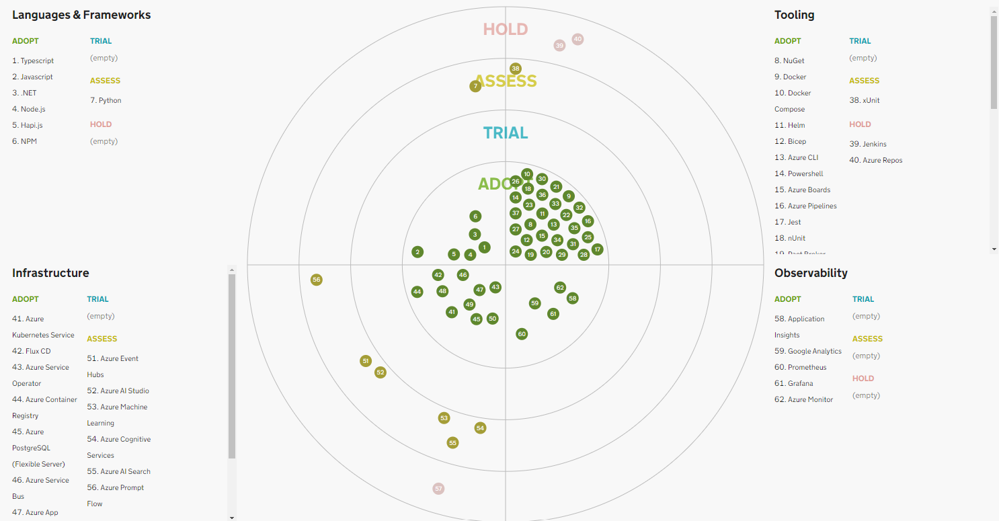

# Tech Radar for ADP

The Tech Radar is a tool to inspire and support teams to pick the best technologies for new projects. It is a visualisation of the technologies that are in use and recommended by the majority of teams. The radar is split into 4 quadrants and 4 rings.

## Quadrants

### Description

The Tech Radar should have 4 quadrants. Each Entry in the technology stack is represented by a _blip_ in a quadrant. The quadrants represent broad categories that entries fit into.

- **Languages & Frameworks**
- **Tooling**
- **Infrastructure**
- **Observability**

## Rings

##Description
The Tech Radar should have 4 rings with the central ring representing entries that are in use and recommended by the majority of teams. Whilst the outer ring represents entries that are not recommended and for which we recommend teams transitions to a recommended entry.

- **Adopt**
  - This technology is recommended for use by the majority of teams with a specific use case.
- **Trial**
  - This technology has been evaluated for specific use cases and has showed clear benefits. Some teams adopt it in production, although it should be limited to low-impact projects as it might incur a higher risk.
- **Assess**
  - This technology has the potential to be beneficial for the organisation. Some teams are evaluating it and using it in experimental projects. Using it in production comes with a high cost and risk due to lack of in-house knowledge, maintenance, and support.
- **Hold**
  - We don't want to further invest in this technology or we evaluated it and we don't see it as beneficial for the organisation. Teams should not use it in new projects and should plan on migrating to a supported alternative if they use it for historical reasons. For broadly adopted technologies, the Radar should refer to a migration path to a supported alternative.

### Entries FFC Technology Stack

The below entries are taken from the [technology stack in the FFC-Development-Guide](https://github.com/DEFRA/ffc-development-guide/blob/main/standards/technology-stack.md).

⚠️ Need to confirm whether any of the categories in the above linked technology stack would be appropriate Portal quadrants

## Technology & Services Stack

| Entry                              | Quadrant               | Ring   | Note                          |
| ---------------------------------- | ---------------------- | ------ | ----------------------------- |
| Node.js                            | Languages & Frameworks | Adopt  |                               |
| Hapi.js                            | Languages & Frameworks | Adopt  |                               |
| NPM                                | Languages & Frameworks | Adopt  |                               |
| .Net                               | Languages & Frameworks | Adopt  |                               |
| Python                             | Languages & Frameworks | Assess |                               |
| Nuget                              | Tooling                | Adopt  |                               |
| Docker                             | Tooling                | Adopt  |                               |
| Docker Compose                     | Tooling                | Adopt  |                               |
| Helm                               | Tooling                | Adopt  |                               |
| Bicep                              | Tooling                | Adopt  |                               |
| Azure CLI                          | Tooling                | Adopt  |                               |
| PowerShell                         | Tooling                | Adopt  |                               |
| Azure boards                       | Tooling                | Adopt  |                               |
| Jenkins                            | Tooling                | Hold   |                               |
| Azure pipelines                    | Tooling                | Adopt  |                               |
| Jest                               | Test Tooling           | Adopt  |                               |
| xUnit                              | Test Tooling           | Assess |                               |
| nUnit                              | Test Tooling           | Adopt  |                               |
| Pact Broker                        | Test Tooling           | Adopt  |                               |
| Web Driver IO                      | Test Tooling           | Adopt  |                               |
| Cucumber                           | Test Tooling           | Adopt  |                               |
| Selenium                           | Test Tooling           | Adopt  |                               |
| BrowserStack                       | Test Tooling           | Adopt  |                               |
| JMeter                             | Test Tooling           | Adopt  |                               |
| Snyk                               | Test Tooling           | Adopt  |                               |
| OWASP Zap                          | Test Tooling           | Adopt  |                               |
| AXE?                               | Test Tooling           | Adopt  |                               |
| WAVE                               | Test Tooling           | Adopt  |                               |
| Anchor Engine                      | Test Tooling           | Adopt  |                               |
| Azure Kubernetes Service           | Infrastructure         | Adopt  |                               |
| Flux CD                            | Infrastructure         | Adopt  |                               |
| Azure Service Operator             | Infrastructure         | Adopt  |                               |
| Azure Container Registry           | Infrastructure         | Adopt  |                               |
| Azure PostgreSQL (flexible Server) | Infrastructure         | Adopt  |                               |
| Azure Service Bus                  | Infrastructure         | Adopt  |                               |
| Azure Event Hubs                   | Infrastructure         | Assess |                               |
| Azure App Configuration            | Infrastructure         | Adopt  |                               |
| Azure Key Vault                    | Infrastructure         | Adopt  |                               |
| Azure Functions                    | Infrastructure         | Hold   | *must be containerized in AKS |
| Azure Storage                      | Infrastructure         | Adopt  |                               |
| Entra ID workload Identity         | Infrastructure         | Adopt  |                               |
| Application Insights               | Observability          | Adopt  |                               |
| Azure Repos                        | Tooling                | Hold   |                               |
| GitHub                             | Tooling                | Adopt  |                               |
| SonarCloud                         | Tooling                | Adopt  |                               |
| Docker Desktop                     | Tooling                | Adopt  |                               |
| Google Analytics                   | Observability          | Adopt  |                               |
| Prometheus                         | Observability          | Adopt  |                               |
| Grafana                            | Observability          | Adopt  |                               |
| Azure Monitor                      | Observability          | Adopt  |                               |
| Visual Studio 2022                 | Tooling                | Adopt  |                               |
| Visual Studio Code                 | Tooling                | Adopt  |                               |
| App Reg's                          | Tooling                | Adopt  |                               |
| Azure CosmosDB (SQL)               | Tooling                | Adopt  |                               |
| Azure CosmosDB (Mongo)             | Tooling                | Assess |                               |
| Azure AI Studio                    | Infrastructure         | Assess |                               |
| Azure Machine Learning             | Infrastructure         | Assess |                               |
| Azure Cognitive Services           | Infrastructure         | Assess |                               |
| Azure AI Search                    | Infrastructure         | Assess |                               |
| Azure Prompt Flow                  | Infrastructure         | Assess |                               |
