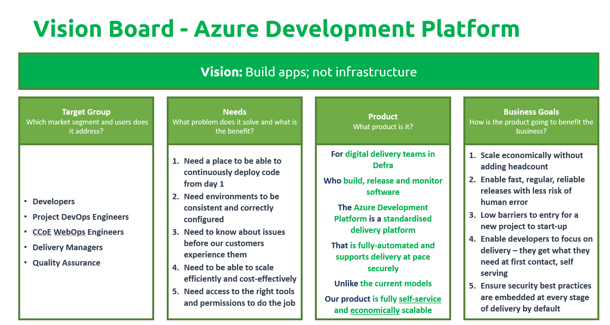
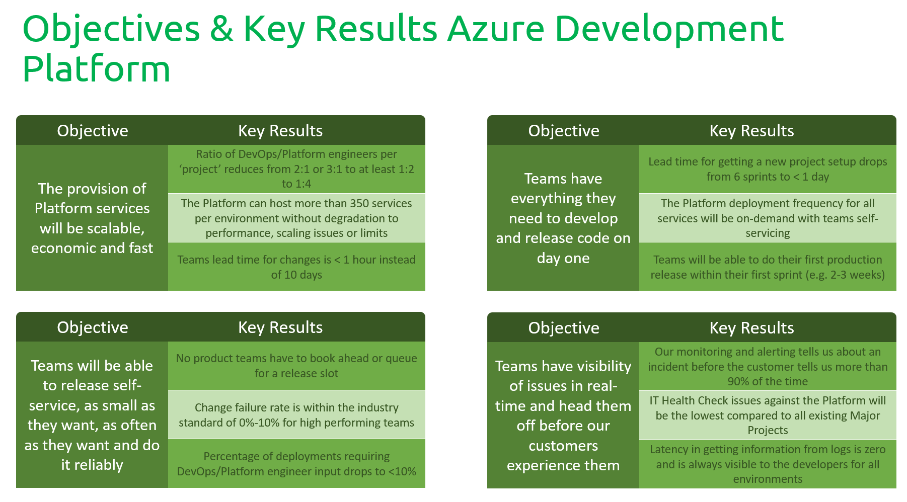

# Azure Developer Platform Strategy

Overall platform strategy for ADP.

!!! note "TODO"
    This page is a work in progress and is being updated in due course.

## **Vision Statement:** Build Applications; not infrastructure.

## **Mission Statement:**  To empower every product development team in Defra to increase the speed of delivery by providing a self-service and standardized Development Platform to host their business applications securely and efficiently.

### **Our Values:**

1. Innovation and evergreen delivery
2. Standardization and compliance
3. Full automation with 'Everything-As-Code'
4. Security, scalability and efficiency
5. Self-service & developer centricity
6. Fully open and transparency
7. Observability and monitorability

### **Our Motto:**

_Move fast, with stable infrastructure and standardized delivery_

**Why?** By providing a stable infrastructure environment with common, tried and trusted delivery processes, we'll enable application teams to move faster and realize business value quicker.

Our reach is Defra Azure wide, and will be able to be used by any product development team across the Digital delivery programme. We will focus on hosting and running digital transactional business applications.

## **Enabling Delivery - What are our Goals and Objectives?**

To achieve our product vision of _**"Build Apps - Not Infra**"_, the following (_initial_) goals and objectives will need to be achieved as part of the Platform delivery.

### **Our product goals**

- _“Product Teams are onboarded on day 1, in less than an hour, onto a Defra infrastructure/delivery Platform with the permissions configured based on their personas, so they can perform their role immediately.”_
- _“Product Teams will be able to self-service their needs by being able to immediately build, test, deploy, and run software in a standardised way that expedites delivery and follows/promotes Defra’s development standards.”_
- _"Engineers will have full observability and monitoring across the estate to be able to run and maintain their applications, securely and efficiently - without having to ask."_
- _"The Platform will have pre-formed 'Exemplar Services', common code libraries, SDKs, etc. that are able to be used by, built upon, and expanded for by Product Teams that will demonstrate integration onto the Platform."_
- _"The Platforms Build and Release processes will be on-demand, with all expected features and processes included out of the box for every development team."_
- _"Everything will be in code, delivered fully by automation, tracked across its lifecycle, and versioned appropriately."_
- _"The Platform will be continuously scalable, efficiently, to any number of product teams that are building transactional business services in Azure, without exponentially adding infrastructure and engineering resource costs."_
- _"The Platform will provide the capability to view the entire estate in a single place. A business user or product team will be able to view a detailed catalogue of all services, documentation, libraries, etc. across all environments."_

