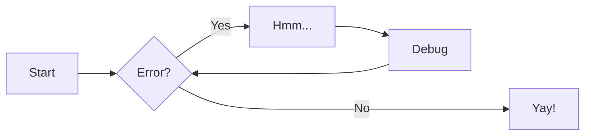
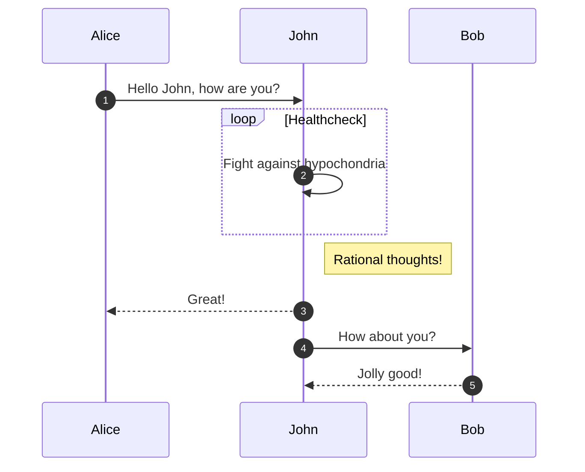

# test

# C#

```c#
using System;

namespace HelloWorld
{
  class Program
  {
    static void Main(string[] args)
    {
      Console.WriteLine("Hello World!");  
    }
  }
}

```

JavaScript

```js
function myFunction() {
  document.getElementById("demo").innerHTML = "Paragraph changed.";
}
```





| Method     | Description                          |
| ---------- | ------------------------------------ |
| `GET`    | :material-check:     Fetch resource  |
| `PUT`    | :material-check-all: Update resource |
| `DELETE` | :material-close:     Delete resource |

<div class="grid cards" markdown>

- :fontawesome-brands-html5: __HTML__ for content and structure
- :fontawesome-brands-js: __JavaScript__ for interactivity
- :fontawesome-brands-css3: __CSS__ for text running out of boxes
- :fontawesome-brands-internet-explorer: __Internet Explorer__ ... huh?

</div>

{ align=left } Lorem ipsum dolor sit amet, consectetur adipiscing elit. Nulla et euismod nulla. Curabitur feugiat, tortor non consequat finibus, justo purus auctor massa, nec semper lorem quam in massa.

<figure markdown>
  { width="300" }
  <figcaption>Image caption</figcaption>
</figure>

[Subscribe to our newsletter](#){ .md-button }
[Send :fontawesome-solid-paper-plane:](#){ .md-button }

Lorem ipsum[^1] dolor sit amet, consectetur adipiscing elit.[^2]

[^1]: Lorem ipsum dolor sit amet, consectetur adipiscing elit.
    
[^2]: Lorem ipsum dolor sit amet, consectetur adipiscing elit. Nulla et euismod
       nulla. Curabitur feugiat, tortor non consequat finibus, justo purus auctor
       massa, nec semper lorem quam in massa.
